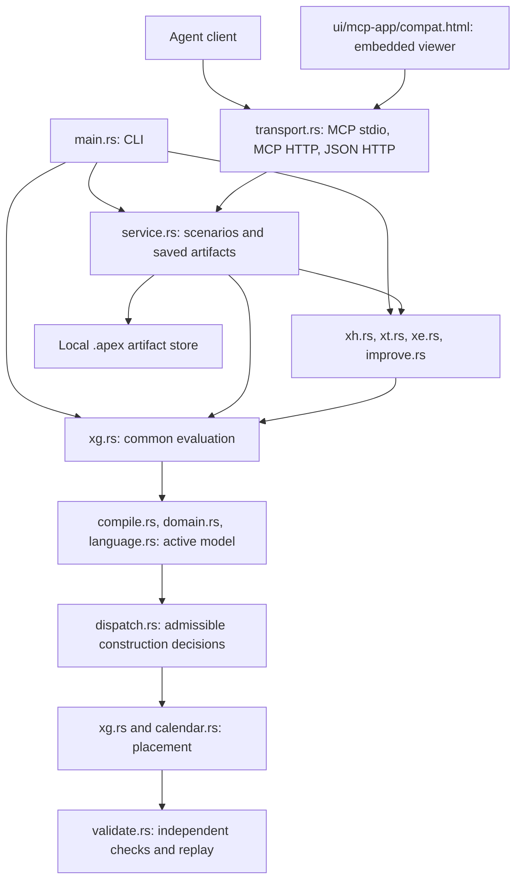
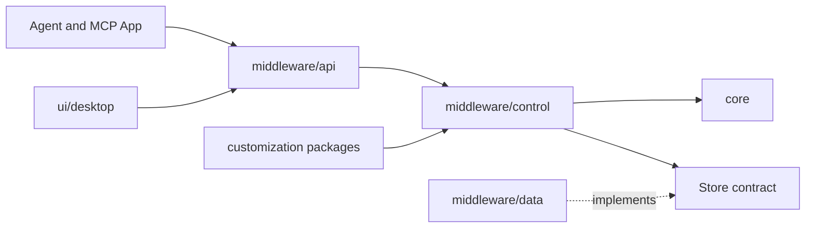

# Current architecture

This is the implementation map for agents changing APEX. Read it after [repository conventions](../../AGENTS.md), then follow the source and test links below. The current scheduling problem and planning vocabulary ship with the application release and have no separate schema versions. There is no separate legacy scheduler in this checkout.

Use the [data model](../data-model.md) for field semantics, the [operating guide](../implementation.md) for commands, and the [migration audit](https://github.com/qunevo/apex/blob/main/dev/docs/migration-audit.md) for historical v2 evidence. This directory documents implemented behavior.

## Runtime boundaries

[Cargo.toml](../../Cargo.toml) is the workspace root and the `apex-scheduler` package with the `apex` library and the `apex` binary. The scheduling core is the `apex-engine` crate in `core/`; the [control platform](../control-platform.md) crates build on it without changing this executable. [lib.rs](../../lib.rs) exposes the modules; [main.rs](../../middleware/api/cli.rs) selects CLI commands and transports. The scheduler does not depend on Python, an LLM or an external solver. Repository Python/Node scripts support fixtures and verification.



The application has five responsibility boundaries. Cargo crates inside them keep
dependencies explicit; they are not separate deployment services.

| Directory | Responsibility |
| --- | --- |
| `core/` | `apex-engine` crate: in-memory scheduling semantics, algorithms and independent validation |
| `middleware/api/` | HTTP/MCP, authentication, events, workers and CLI entry points |
| `middleware/control/` | Scenarios, immutable revisions, runs, approvals, package configuration and core invocation |
| `middleware/data/` | PostgreSQL store, migrations and compatibility file persistence |
| `ui/mcp-app/`, `ui/desktop/` | MCP App and native display clients of the same middleware |
| `skills/` | General agent workflows |
| `customization/<id>/` | Package manifest, adapters, domain model/knowledge, skills, tests and optional views |

`lib.rs` retains existing public module re-exports for library callers. The service
orchestrates persistence through `data::FileStore`; scheduling modules operate
on in-memory models. CLI `plan`, `hypersearch`, `treesearch`, `improve` and `evolve` also call those modules directly. Search changes candidate decisions or ranking parameters and uses the same evaluation path as quick planning.



`middleware/control/src/apex.rs` is the optional built-in implementation of the
engine contract. It is not a separate adapter service. Domain source adapters
belong in `customization/<id>/adapter`. The desktop depends on control contracts
without enabling the `apex` feature. The MCP App receives `results.get` through
its host bridge and does not persist authoritative planning state.

The [container deployment](../containers.md) starts this central server with
PostgreSQL; it does not start the compatibility executable or native desktop.
Application container files are independent of the root demo. The root demo
composes additional source services and selects a customization through config.

## Source map

All module links below point into `core` unless stated otherwise.

| Responsibility | Entry points and related modules |
| --- | --- |
| Serialized input, options and output | [model.rs](../../core/model.rs): `Problem`, `Options`, `Schedule`, activities, commitments and diagnostics. Additional typed contracts live beside their implementation in `language`, `policy`, `queues` and `xe`. |
| Production templates | [production.rs](../../core/production.rs): `ProductionInput`, `expand`; expands orders, quantities and workplans into canonical tasks. It does not schedule them. |
| Readiness and indexes | [compile.rs](../../core/compile.rs): `compile`, `Compiled`; validates supported inputs, resolves IDs and builds dependency and dispatch graphs. [urgency.rs](../../core/urgency.rs) derives upstream dispatch urgency. |
| Active problem | [domain.rs](../../core/domain.rs): `resolve`; selects routes, removes inactive work, expands quantity formulas and applies job/order defaults. [language.rs](../../core/language.rs) lowers typed planning templates; [conditionals.rs](../../core/conditionals.rs) checks and applies conditional choices. |
| Material preparation | [material.rs](../../core/material.rs): existing-supply allocation, pegging and route/mode-aware preparation. Flexible allocation runs during active-model resolution; explicit preparation creates a separate scenario. |
| Construction and policy enforcement | [dispatch.rs](../../core/dispatch.rs): `decisions_with`, `choices`; common ready-pool selection. [policy.rs](../../core/policy.rs): mandatory filters and replay. [placement.rs](../../core/placement.rs): private exact-placement oracle for those filters. |
| Ranking and objectives | [queues.rs](../../core/queues.rs): Q definitions, normalization and stage policies. [rules.rs](../../core/rules.rs): bounds, rank, exact objectives and score. [metrics.rs](../../core/metrics.rs): KPI catalog and evaluation. |
| Schedule construction (XG) | [xg.rs](../../core/xg.rs): `create`, `evaluate`, `decode`, `conditional_specs`; orchestrates evaluation and places main/pre/post/restart work. [activities.rs](../../core/activities.rs) handles conditional DAGs; [calendar.rs](../../core/calendar.rs) places phased work against resource calendars and occupancy. |
| Hypersearch (XH) | [xh.rs](../../core/xh.rs): Q-policy mutation, crossover and population search. |
| Tree search (XT) | [xt.rs](../../core/xt.rs): UCT tree, prefix expansion and rollouts. |
| Direct evolution (XE) | [xe.rs](../../core/xe.rs): schedule chromosomes and genetic operators. |
| Shared search and portfolio | [search.rs](../../core/search.rs): budgets, workers, randomness, selection and reporting helpers. [improve.rs](../../core/improve.rs): shared-budget XH/XT/optional XE portfolio. |
| Independent validation | [validate.rs](../../core/validate.rs): `validate`, `validate_active`, `validate_customized`; reconstructs expected semantics and checks output. Uses `policy::verify` for governed construction and [extensions.rs](../../core/extensions.rs) for native validation and metrics. |
| Native customization | `rules::Customization` declares the contract. [extensions.rs](../../core/extensions.rs) registers, lowers and decorates models. [customization/demo](../../customization/demo/model/KNOWLEDGE.md) is the linked synthetic example. |
| Agent API and viewer | [service.rs](../../middleware/control/compat.rs): `Service::call`, package routing and tool orchestration. [transport.rs](../../middleware/api/compat.rs): tool schemas, JSON-RPC, HTTP and OpenAPI. [ui/mcp-app/compat.html](../../ui/mcp-app/compat.html): embedded schedule viewer and optional development workbench. |

## One scheduling evaluation

Trace `xg::create` / `create_internal` when debugging a result. `xg::evaluate` is the shared entry used by search workers.

1. **Check options and lower a native extension.** If a customization is selected, `extensions::registered` resolves its version and `extensions::lower` produces typed input with declared native objectives, Qs and conditional choices. Unknown customizations fail. Validate requested strategies and decision options before constructing a schedule.
2. **Compile and resolve the active model.** `compile::compile` checks the input. `domain::resolve` lowers the planning block, chooses workplan alternatives, applies quantities and conditional choices, and performs configured material allocation. Hard commitments constrain these choices. Compile the resolved problem when it differs from the original.
3. **Choose an admissible construction order.** `dispatch::decisions_with` tracks dependency readiness, mode/resource/order commitments and consecutive blocks. Mandatory policies filter eligible task/mode pairs before heuristic ranking. Qs, classic strategies and soft priority orders rank only the remaining choices. A forced prefix must survive the same checks.
4. **Decorate and decode.** Native sequence hooks can add declared pre/post activities and setup charges. The decoder builds conditional graphs from task/mode activities, neighbor transitions, sequence patterns, terminal cleanup and running-work restart records. `calendar::place` places work and reservations; the engine enforces dependency timing and material availability. A placement failure rejects the candidate.
5. **Evaluate the result.** Compute actual KPIs, objective values and score; attach route/material choices, construction order, replay options and any policy witness. Native metric hooks run here. Non-finite values or objectives without an evaluator fail.
6. **Validate before accepting.** The validator resolves saved choices, checks physical assignments and metrics, and verifies mandatory-policy witnesses. A customized result also passes native validation and independent native metric evaluation. Only an accepted result becomes a search candidate or saved schedule.

Validation does not trust success from the constructor. It shares typed semantics and some helpers with construction, so a new rule still needs negative and deliberately corrupted-output tests.

## Data and semantic boundaries

| Concept | Meaning when changing code |
| --- | --- |
| `Problem` and `Options` | `Problem` contains model facts and persistent commitments. `Options` selects a run's search settings and requested decisions. Do not silently write search preferences back into business facts. |
| `Compiled` | Borrowed problem plus lookup tables, precedence graphs and derived urgency. Rebuild it after changing the active problem. |
| `Decisions` and `Schedule` | Decisions select task order and modes. Decoding produces timed activities. `Schedule.construction` records actual decoder order; assignment array order is not a replacement for it. |
| Work segments and reservations | Segments describe productive work. Reservations describe resource occupancy, including retained pauses. Calendar breaks, rates and retention mean occupied time and work are different quantities. |
| Main end and product readiness | `Assignment.end` is main completion; `ready` includes required post-processing. Product dependencies and completion metrics must use their declared event, not assume these timestamps coincide. |
| Dependency and resource order | A product dependency waits for the predecessor's release plus lag. A resource sequence lock constrains construction/resource order without automatically waiting for independent post-processing resources. `Compiled` keeps separate graphs for these meanings. |
| Constraint, policy and Q | A physical constraint applies to the final schedule. A dispatch policy restricts the next decision against its prospective prefix. A Q is a heuristic ranking value. One cannot substitute for another. |
| Hard prefix and soft order | `decision_prefix` pins decisions. `decision_order` expresses task priorities for direct evolution; dependencies, locks and mandatory filters remain binding. Caller-supplied route/mode/conditional choices must also survive search. |
| Due date and urgency | Due dates remain business facts. Derived upstream urgency can prioritize predecessors without changing their original dates or completion metrics. Soft due dates do not become hard deadlines. |

See [declarative scheduling](declarative-scheduling.md) for filter order, exact probes, the native prefix contract and bounded replay evidence.

## Search shares construction

| Entry point | What it varies |
| --- | --- |
| `schedule.create` / `xg::create` | One constructive pass using the requested/default policy. The CLI and service default to `queues`; `Options::default()` in the library defaults to `due`. |
| `schedule.hypersearch` / `xh::search_with` | Evolves Q-policy configurations, weights/normalization and supported choices; evaluates complete schedules. It is instance-specific search. |
| `schedule.treesearch` / `xt::search` | Retains a bounded UCT prefix tree and completes branches with shared construction. It does not enumerate all feasible schedules. |
| `schedule.evolve` / `xe::evolve` | Evolves task-priority chromosomes and route/main-mode/conditional genes. Native operators propose candidates; they cannot bypass evaluation. |
| `schedule.improve` / `improve::improve_from` | Runs XH, then XT from retained policies, then optional GA, sharing one budget, incumbent and archive. Defaults are 40% XH, remaining allowance XT, zero reserved GA share. |
| `schedule.repair` | Uses the XH path on the current scenario, including its commitments. It reconstructs a schedule; it does not patch a cached schedule in place. |

Search evaluates candidates on worker threads when configured, while portfolio phases run sequentially. Time budgets are soft checks between evaluations/batches; a single expensive evaluation can overrun. Evaluation counts include rejected candidates. An exhausted constructor or search does not prove infeasibility.

The [combined-improvement contract](combined-improvement.md) specifies budget division and incumbent handling. [Search semantics](../search-and-parity.md) and [direct evolution](../direct-schedule-evolution.md) define candidate spaces, reproducibility and operator evidence.

## Service state, transport and UI

The central `apex-control` service owns immutable scenario revisions, queued runs,
validated results and approval/publication through the `Store` contract. Its
PostgreSQL implementation is in `middleware/data`; the in-memory store supports
tests and transient demonstrations. Both clients use this workflow; see the
[control platform](../control-platform.md) for deployment and authorization.

The following describes the retained file-backed `apex` compatibility interface.
It has separate records and does not automatically migrate them to PostgreSQL.

The default store is `.apex` under the configured workspace. `middleware/data/files.rs` stores separate JSON artifacts for imports, scenarios and schedules. Writes use a temporary file, flush/sync and rename. `Service::call` selects the request package and holds its exclusive `store.lock` across the entire tool call, including scheduling. Calls sharing a store therefore serialize; search workers provide parallel candidate evaluation inside a call. Chunked imports reduce request/context size, but the complete problem is still held in memory for planning.

With explicit configuration, package state is scoped by ID and version and input
files by package ID. Responses, saved records and viewer links retain package
context. Requests never change a global active package. Unconfigured flat stores
remain compatible. See [server configuration](../server-configuration.md) for
selection, version changes and shared-trust limitations. Use `apex-control` for
active-plan lifecycle, tenant authorization and MCP Apps resources.

A scenario has a revision, problem and optional parent. Patches require `expected_revision`. A saved schedule contains its scenario identity/revision, the exact problem snapshot and the result. Improve/evolve can reuse an incumbent only for the same scenario and revision; after a patch or fork, create a result for that model. Validation and explanations use the saved problem, not the current mutable scenario.

`service::tool_names` and `transport::tools` expose the same 32 operations over MCP stdio, stateless MCP HTTP at `/mcp`, and JSON HTTP. Responses larger than 64 KiB are retained as local artifacts with a bounded reference; paging keeps routine tool output small. Transport/authentication and import contracts are in [agent integration](../agent-integration.md).

The viewer is compiled into the Rust binary with `include_str!`; HTML edits require a rebuild before browser verification. The default UI reads saved plans, KPIs and commitments. `?mode=workbench` enables development controls. Keep ordinary planning and rule changes in the agent workflow; the UI does not run its own scheduling engine.

## Customization boundary

Server packages group adapter, model, skills, tests and optional UI by domain.
[Package configuration](../../middleware/control/src/packages.rs) validates manifests; it does not
execute code. [Data storage](../../middleware/data/files.rs) owns persistence. Package selection
and `Problem.customization` have different meanings: the latter selects native
scheduling behavior. The demo package's live MES/Excel adapter is not implemented.

`rules::Customization` covers typed lowering, sequence decorations, candidate filters/rank, Qs, objectives/metrics, validation and genetic proposals. Native implementations are deterministic, versioned, statically linked and `Send + Sync`. Registration is explicit in `extensions::registered`; `demo@1` is the current bundled implementation.

Keep reusable physical semantics in the core and optional domain behavior in customization modules. New native code needs a build. Tool arguments, Markdown knowledge and `skills/` guide the agent; they do not execute plugins or enforce rules. Sequence hooks used by exact dispatch policies must support meaningful prefix decoration, with tests for every affected interaction.

## Change map for coding agents

Read existing tests in the affected row before editing. Synthetic regression inputs are in [tests/fixtures](../../tests/fixtures); the embedded production demo input belongs to [customization/demo](../../customization/demo/model/production-orders.json). Never turn customer exports into fixtures.

| Change | Update together | Verification starting points |
| --- | --- | --- |
| Input field or physical rule | Typed model, readiness in `compile`/domain checks, lowering, decoder/calendar semantics, independent validator and schema/docs | [core](../../tests/core.rs), [migration](../../tests/migration.rs), [parity](../../tests/parity.rs) |
| Material/order/workplan behavior | `production`, `material`, `domain`, consumption/release handling in `engine` and `validate` | [material](../../tests/material.rs), [migration](../../tests/migration.rs), [material tool workflow](../../tests/material-workflow.mjs) |
| Mandatory next-choice rule | `language`, `policy`, shared `dispatch`, exact `placement` where needed, replay/diagnostics | [dispatch](../../tests/dispatch.rs), [customization](../../tests/customization.rs); include singleton, forced-prefix and beyond-Q-window cases |
| Objective or Q | Exact `rules`/`metrics` evaluator, direction/scale/priority, readiness, independent metric check, explicit `queues` mapping and search behavior | [search](../../tests/search.rs), [improve](../../tests/improve.rs), [evolution](../../tests/xe.rs); test actual fitness separately from the heuristic proxy |
| Search or genetic operator | `xh`/`xt`/`xe`/`search`/`improve`, option types, budget accounting, commitment preservation, replay and evidence | [search](../../tests/search.rs), [improve](../../tests/improve.rs), [evolution](../../tests/xe.rs) |
| Native domain rule | `Customization` implementation, registry/version, typed lowering, metric/validation hooks and synthetic knowledge bundle | [customization](../../tests/customization.rs), relevant dispatch/XE tests |
| Tool or persistence behavior | Service dispatch, `tool_names`, `transport::tools` schema/OpenAPI and saved-artifact revision semantics | [service](../../tests/service.rs), [MCP smoke](../../tests/mcp-smoke.mjs), [HTTP/MCP](../../tests/http-mcp.mjs) |
| Viewer explanation | `ui/mcp-app/compat.html` and bounded service fields needed to explain the decision | [viewer plan smoke](../../tests/viewer-plan-smoke.mjs), [dispatch viewer](../../tests/viewer-dispatch-smoke.mjs), [evolution viewer](../../tests/viewer-xe.mjs) |

For Rust changes run the required checks from the application root (`app/` in the development checkout):

```text
cargo fmt --check
cargo clippy --all-targets -- -D warnings
cargo test
cargo build --release
```

When serialized types change, regenerate and review affected current schemas with the rebuilt binary:

```text
target/release/apex schema --out schemas/scheduling-problem.schema.json
target/release/apex schema --model production --out schemas/production-orders.schema.json
target/release/apex schema --model options --out schemas/planning-options.schema.json
```

Use `target/release/apex.exe` on Windows. Keep only the current generated schema snapshots under these role-based, versionless filenames; see [schema roles and tool releases](../data-model.md#schema-roles-and-tool-releases). The installed tool accepts its current input contract; do not keep historical schema snapshots or add format-version dispatch. Rebuild before MCP/browser verification; follow the [operating guide](../implementation.md) for relevant smoke commands. Generated reports and `.apex` artifacts stay local. Documentation-only edits need link, example and source-reference checks rather than scheduler benchmarks.

## Current limits

- The decoder constructs append-based schedules with integer-second time and fixed resource identities within each phase. It has no completeness or optimality guarantee.
- Exact policy probes use a specialized independent-task fast path or reconstruct `prefix + candidate`. There is no general transactional rollback or incremental cross-resource repair engine.
- The `apex` service uses a local file store and serialized tool calls. Tenants, durable runs, approval and publication belong to the separate [control platform](../control-platform.md).
- There is no external solver backend, stochastic simulator, general simultaneous batch formation, arbitrary plugin hot-loading, automatic Q-formula generation or automatic operator synthesis.
- Passing current tests does not establish complete v2 parity. Keep measured comparisons in the [migration audit](https://github.com/qunevo/apex/blob/main/dev/docs/migration-audit.md) and separate benchmark workstream.
