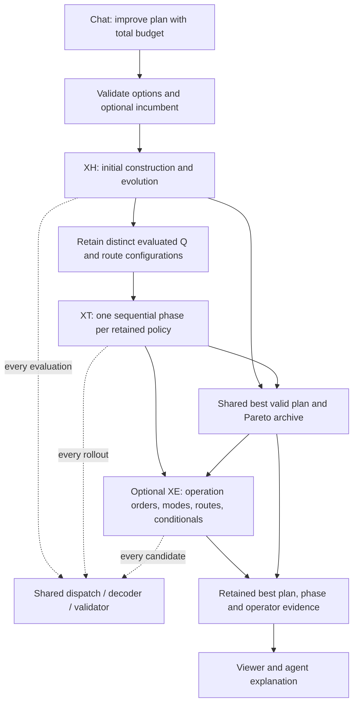

# Combined improvement

Current APEX portfolio contract. The executable input is `apex.v3.4`; `Options.improve` controls the shared search budget. Read the [architecture map](README.md) for module boundaries and [direct evolution](../direct-schedule-evolution.md) for the GA contract.

## Planner-facing contract

The planner asks for a quick plan or an improved plan. The chat agent uses `schedule.create` or `schedule.improve`; it does not ask the planner to select XH versus XT. Individual `schedule.hypersearch` and `schedule.treesearch` tools remain available for explicit diagnostic comparisons. The normal browser remains a read-oriented viewer. The optional workbench has **Quick plan** and **Improve plan**.

Supply the `scenario_id` returned by the scenario tool and optionally a saved `schedule_id` from the same revision. The following example shows the request's `options` object.

```json
{
  "options": {
    "iterations": 128,
    "budget_ms": 5000,
    "seed": 42,
    "xh": {"population_size": 16, "workers": 2},
    "xt": {"workers": 2, "depth": 8, "branching": 4},
    "improve": {"xh_share": 0.4, "xe_share": 0.0, "policies": 3}
  }
}
```

Omit `schedule_id` after changing or forking the scenario. An incumbent must belong to the exact scenario identity and revision, pass independent validation and satisfy any additional requested mode/route/prefix options. This prevents comparing scores from changed objectives. Replay data, metrics and physical constraints remain authoritative. Existing saved results remain readable.

CLI: `apex improve INPUT.json --options OPTIONS.json --out RESULT.json`.

## Actual algorithm



1. XH receives `xh_share` of the total evaluation allowance (floor, at least one) and approximately that share of the remaining time; the default is 40%. Its initial population includes the requested constructive strategy, so a separate duplicate baseline construction is unnecessary. An optional incumbent is retained separately.
2. A bounded pool retains the best distinct **evaluated Q configurations and resolved routes** seen during training. `improve.policies` defaults to three and accepts one to eight slots. With at least two slots, the first valid Q configuration is reserved as a reference and explored first: a better greedy score does not imply a better rollout policy. A one-policy configuration uses the best retained seed. Equal objective scores do not remove a distinct configuration. Diversity is structural, not a measured behavioral distance. Classic reference strategies can win the overall run but are not mislabeled as evaluated Q policies.
3. XT receives each retained policy for both branch ranking and complete rollouts. The seed's actual route configuration is retained. The validated seed is reused without charging a second evaluation. After reserving the GA share, remaining time and evaluations are divided among the remaining seeds, reference first, then elites in score order; unused allowance carries forward. A complete prefix tree is retained within each XT phase.
4. The optional XE receives its remaining global allowance and a bounded pool of validated schedules from earlier phases. Its operators and discounted-UCB selection are described in the [direct-evolution contract](../direct-schedule-evolution.md). The default reserve is zero; a positive `xe_share` enables this phase. Historical fixed-share regressions are recorded in the [migration audit](https://github.com/qunevo/apex/blob/main/dev/docs/migration-audit.md).
5. Every new successful evaluation updates the same incumbent and bounded nondominated archive. Under a fixed model and objective definition, the final score cannot be worse than any valid candidate already observed. This does **not** imply dominance over either standalone search given its own whole budget.
6. If training finds no usable Q seed, XT still runs from the requested/default policy; a successful classic candidate can remain the incumbent. Failed greedy construction does not prove infeasibility.

The evaluation cap is shared, includes failed complete evaluations and honors `xh.max_evaluations` as an override for `iterations`. Zero disables an evaluation/time cap. At least one total evaluation/time cap is required; an XH generation limit alone cannot bound XT. Generation limits restrict XH and GA separately. With one evaluation, the run can only attempt the initial construction.

Time is **soft**, checked between complete evaluations or worker batches. Initial validation, normalization and portfolio administration count toward the outer elapsed time. One expensive decoder/probe/worker batch can exceed the allowance or consume the entire run before XT starts. There is no asynchronous cancellation or guaranteed response-time SLA.

With time disabled, deterministic customizations and fixed seed/options/worker counts, runs reproduce their decisions. XT exploration can change with its worker count. Workers are reused as settings within each phase; phases run sequentially, avoiding nested worker pools and oversubscription. Phase evidence reports evaluations, rejected candidates, elapsed time, stop reason, handed-off policy/routes and the best score so far. Progress retains the first 127 strict improvements and the latest one; it is post-run evidence, not a streaming progress API.

There is no adaptive budget learning, resumed cross-request search, alternating XH/XT feedback cycle or automatic translation of a successful XT sequence back into Q weights.

## Implementation responsibilities

| Module | Responsibility |
| --- | --- |
| [improve.rs](../../src/improve.rs) | `improve_from` checks options and incumbent, allocates phase budgets, retains seeds, and merges progress, archive and best result. |
| [xh.rs](../../src/xh.rs) | XH evolves policy configurations and reports evaluated candidates to the portfolio. |
| [xt.rs](../../src/xt.rs) | XT explores prefixes and rolls out using a retained policy, reporting evaluated candidates to the portfolio. |
| [search.rs](../../src/search.rs) | Shared budgets, workers, randomness, selection and report helpers. |
| [xe.rs](../../src/xe.rs) | Evolves priority chromosomes and mode/route/conditional genes from validated schedules; selects and credits built-in or registered native operators. |
| [xg.rs](../../src/xg.rs) | `evaluate` runs common lowering, dispatch, decoding, exact metrics and validation. A search strategy cannot opt out of hard rules. |
| [service.rs](../../src/service.rs) | Verifies incumbent scenario identity and revision before invoking the portfolio; saves the accepted result with its problem snapshot. |

A new search decision must be represented in options/replay, preserve caller commitments and pass shared evaluation. A new objective needs its exact evaluator and validation before a heuristic Q can rank candidates for it. See the [change map](README.md#change-map-for-coding-agents) for the affected modules and tests.

## Limits and verification

The portfolio searches the current constructor's decision space. It does not optimize arbitrary start times, incrementally repair an existing schedule, synthesize Q formulas or generate new operators at runtime. The bandit chooses among implemented operators. Native extensions require a tested repository change and rebuild.

Use [combined-improvement tests](../../tests/improve.rs) for incumbent compatibility, shared budgets, fallback and reproducibility; [search tests](../../tests/search.rs) for XH/XT semantics; and [evolution tests](../../tests/xe.rs) for commitment preservation, genetic proposals and operator evidence. Add rejected-input and corrupted-result cases when changing these contracts.

Quality comparisons require identical total nominal budgets, reported overruns and actual schedule objectives; simply spending both standalone budgets would not establish an advantage. A larger portfolio or a third phase is not guaranteed to improve quality. The [migration audit](https://github.com/qunevo/apex/blob/main/dev/docs/migration-audit.md) retains historical comparisons; [search semantics](../search-and-parity.md) and [declarative scheduling](declarative-scheduling.md) define current behavior.
