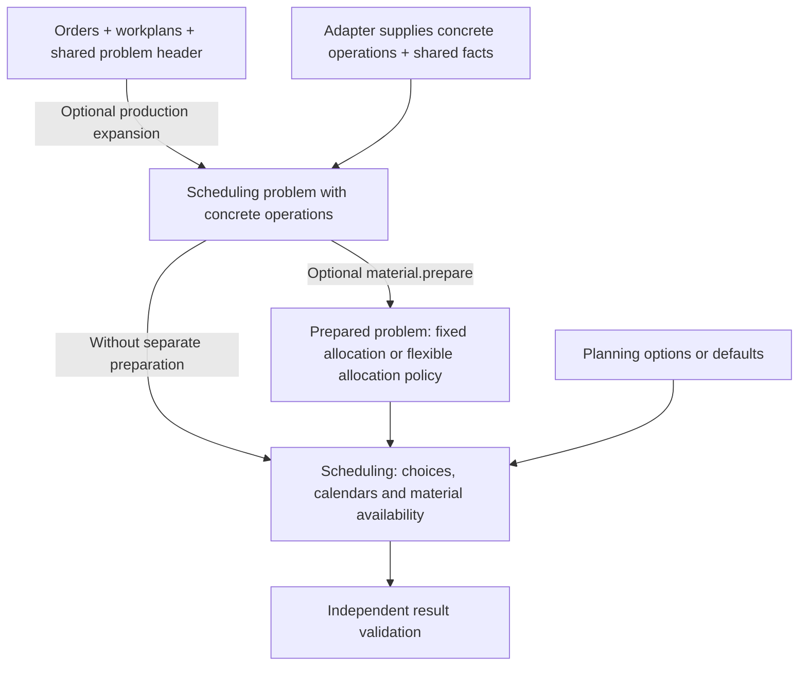

# Input schemas and the planning workflow

These three schemas describe different inputs to the same planning workflow. They are not three datasets that must all be imported. APEX ultimately schedules a `Problem`; you can supply it directly or generate it from production orders and workplans.

## Which schema do I need?

| Schema | Input and purpose | When to use it |
| --- | --- | --- |
| [Production orders](production-orders.schema.json) | `ProductionInput`: a shared `problem` header, reusable `workplans` and order `demands` | Optional. Use when APEX should expand order quantities into lots and concrete operations. |
| [Scheduling problem](scheduling-problem.schema.json) | `Problem`: concrete operations, resources, calendars, material facts, dependencies, constraints and objectives | The engine's input, supplied directly or produced by expansion. A second problem document is not needed after production import. |
| [Planning options](planning-options.schema.json) | `Options`: settings and requested choices for one scheduling/search run | Optional overrides. Omitted options use defaults. Options can be inline tool arguments or a CLI options file; they do not supply factory data. |

The production schema contains the shared problem types so that a production document can be validated on its own. This overlap describes the same types; it does not mean that two copies of the factory data must be maintained.

The tool names below refer to the engine-facing `apex` service. The [control platform](../docs/control-platform.md) stores the resulting scheduling problem as scenario facts and invokes the same engine.

## Starting from orders and workplans

Use `production.import` or CLI `apex expand`. The production document includes all three parts:

- `problem`: the horizon/epoch, resources and their calendars, opening `inventory`, confirmed `receipts`, and applicable rules and objectives.
- `workplans`: reusable operation templates, material requirements/outputs and operation dependencies, including alternative workplans where needed.
- `demands`: order quantities, permitted workplans, dates, priorities and optional maximum lot sizes (`max_lot`).

Expansion creates `orders`, `jobs` (lots), `tasks` (operations), route choices and dependencies. It preserves the shared facts from `problem`. The generated collections `tasks`, `jobs`, `orders`, `routes` and `dependencies` must be empty in the input header; mixing existing operations into that header is rejected.

For example, one demand for 25 units with `max_lot: 10` produces lots of 10, 10 and 5 units. With one two-operation workplan, this creates six operations. Without `max_lot`, that demand becomes one lot. This is explicit quantity expansion, not economic lot-size optimization.

Template material amounts are per unit. Expansion scales them by lot quantity and the template task's quantity multiplier. In the resulting `Problem`, `consume` and `produce` are operation totals. A `$job` item key becomes lot-specific so intermediate material can stay within that lot.

Expansion does not fetch calendars, stock, receipts or BOMs. The source adapter must supply those facts. It does not assign dates to operations or automatically call `material.prepare`. After `production.import`, continue with its saved scenario; after `apex expand`, use the generated problem. Do not import another independently maintained problem for the same work.

See the [quantity and workplan contract](../docs/data-model.md#quantities-workplans-and-orders) and a [synthetic production input](../customization/demo/model/production-orders.json).

## Starting from existing lots and operations

If an ERP/MES or adapter already supplies concrete operations, import a complete `Problem` through `problem.import`, use the chunked import workflow, or pass it directly to the CLI planner. Skip `ProductionInput`, workplan templates and production expansion.

The adapter now owns lot sizing, operation identities, quantities, dependencies and any alternative routes. Supply `jobs` and `orders` when their grouping and completion metrics are needed; ungrouped tasks are also supported. Running work belongs in concrete tasks with execution state, not repeated production templates.

Direct import replaces only the order-to-operation expansion step. It still needs resources, calendars, processing requirements and the relevant inventory, receipts and material maps. It does not automatically split tasks into more lots. Use total material quantities per operation; they are not multiplied again by `Task.quantity`.

### Operations, workplans and rules

An operation (`Task`) is concrete work to schedule. A workplan is a template from which operations can be generated. Scheduling rules constrain or rank that work: supported rules belong in the problem, including its typed `planning` block, and apply with either import path.

Supplying rules directly does not replace operations, calendars or material facts, and it does not create lots or trigger material preparation. Planning options configure a run; they are not a replacement for persistent business rules. See [declarative scheduling](../docs/architecture/declarative-scheduling.md).

## When does the material dispatcher run?

**Production expansion creates lots and operations. Material preparation allocates supply to those operations.** The current material allocator uses existing usable stock, confirmed receipts and outputs of supplied production operations. It does not create missing manufacturing orders, new lots, procurement proposals or replenishment quantities.

`material.prepare` is an explicit optional step after either import path and before scheduling. It takes a `scenario_id`, its `expected_revision` and optional route/mode selections. These preparation options are the narrower `DispatchOptions` contract, not the full planning-options schema. The call returns a new scenario and an allocation report; it leaves the source revision unchanged. Schedule the returned scenario to use that preparation.

| Material path | When allocation happens | What scheduling enforces |
| --- | --- | --- |
| No explicit preparation and no `material_policy` | There is no separate consumer-specific allocation pass. | The normal decoder still checks material balances and availability while placing operations; independent validation checks the result. |
| Preparation with all routes and material-relevant mode choices fixed | `material.prepare` assigns supply and creates a materialized problem with internal allocation tokens and precedence edges. | Those allocations bind the prepared snapshot and are enforced during scheduling and validation. |
| Flexible routes or modes with different material requirements | Preparation keeps alternatives open and sets `material_policy: "reallocate_routes"`. Its initial report is a preview. | Allocation runs again after actual route/material-mode choices are resolved for each evaluation, before placement. Saved schedules carry their actual allocation report. |

This behavior is the same whether operations came from production expansion or direct import. Simply importing orders or operations does not enable the separate material allocator. A problem carrying `material_policy: "reallocate_routes"` activates allocation during evaluation; ordinary readiness checks alone do not.

Do not prepare an already prepared snapshot again. For material/routing changes to a fully selected, materialized snapshot, change and reprepare the original source. Flexible models reallocate during evaluation. Neither path invents missing supply; shortages or blocked supply relationships produce diagnostics. This is finite-capacity scheduling with existing-supply allocation, not MRP.

See [material preparation](../docs/material-dispatch.md) for policy, reports, running work and limits. The implementation boundaries are [production expansion](../core/production.rs), [material preparation](../core/material.rs) and [active-model resolution](../core/domain.rs).

## Schema files and application releases

The schemas are generated from the current Rust input types and ship with the main application release. There is no independent schema-version stream, `schema_version` field or nested planning version. Use the schemas from the installed release; for development builds, retain the source revision as well.

The parser reads the current Rust types and performs semantic checks. It does not load these JSON files to schedule, select historical parsers or automatically migrate old inputs. Unknown fields are rejected. The JSON Schema `$schema` URI identifies the standard schema dialect, not an APEX release.

Use `apex schema` or the `schema.get` tool to discover the installed contract (`problem`, `production` or `options`). Agents can request a named definition instead of loading every schema into context. The [data model](../docs/data-model.md#schema-roles-and-tool-releases) explains validation and release boundaries; the [architecture guide](../docs/architecture/README.md#change-map-for-coding-agents) describes schema regeneration and affected tests.
