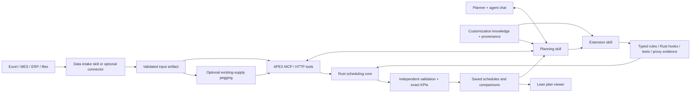

# Chat-led scheduling

The default web UI is a plan viewer: schedule, KPIs, order completion, commitments and operation details. It does not require the planner to understand scenario forks, patches, Q policies or search budgets. The agent performs those operations through tools and returns a saved-plan link. `?mode=workbench` exposes the development controls when needed.

The **Discuss in your chat** button copies a bounded context with scenario, revision, schedule, baseline and selected operation IDs. It does not send a message or embed another model. A tool-capable chat needs an actual MCP/HTTP connection; a URL alone does not grant tool access. The UI is independent of the chat provider.

## Roles, not mandatory separate agents

Three portable repository skills live in `.agents/skills`:

| Skill | Responsibility | Handoff |
| --- | --- | --- |
| `apex-data-intake` | Read authorized sources, convert units and relationships, validate and import | Scenario/revision, source mapping, counts, unresolved facts |
| `apex-planning` | Discuss domain rules, explain plans, run scenarios and sensitivity cases | Validated results, KPI trade-offs, viewer links |
| `apex-extension` | Implement new rules, objectives, hooks and measured Q proxies | Tested code/schema, synthetic examples, documented limits |

A single agent can switch skills. Separate agents are optional when distinct credentials, domains or independently testable implementation work justify them. They must exchange artifact references and explicit requirements, not duplicate full production exports in their context. These are ordinary Markdown skills; hosts without skill discovery can load the relevant file as workflow guidance.

External writeback is deferred. A later writeback capability needs an explicit target, source revision, agreed change set, conflict handling and retry semantics. The current roles do not publish plans into MES/ERP.



```mermaid
sequenceDiagram
  actor Planner
  participant Agent
  participant APEX
  participant Viewer
  Planner->>Agent: Compare an outage; keep today's assignments fixed
  Agent->>APEX: Inspect saved baseline + current revision
  Agent->>APEX: Fork scenario; freeze requested dimensions; patch outage
  Agent->>APEX: Quick plan / Improve plan with an explicit total budget
  APEX-->>Agent: Saved validated plan + search report
  Agent->>APEX: Compare baseline and candidate
  Agent-->>Planner: Trade-offs, assumptions and view link
  Planner->>Viewer: Inspect schedule and fixed commitments
```

## Domain knowledge and implementation

Keep human-readable rules in customization Markdown with: stable rule ID, statement, source, owner, units, scope, hard/soft classification, exceptions, status and links to implementation/tests. Proposed rules and estimates remain distinct from confirmed facts. This record helps the agent discuss requirements; it does not execute constraints.

A new metric needs its exact schedule evaluation and a useful candidate-ranking estimate. Standard Q mappings cover common goals. A coding agent can add a custom Q, but no general method guarantees that automatically generated proxies correlate well with every objective. Measure correlation/regret on full schedules and held-out cases, keep adverse cases visible, and retain exact fitness and independent validation.

Trainer optimizes policies; it is not the correctness checker. See [search semantics](search-and-parity.md), [material preparation](material-dispatch.md) and [transport setup](agent-integration.md).
