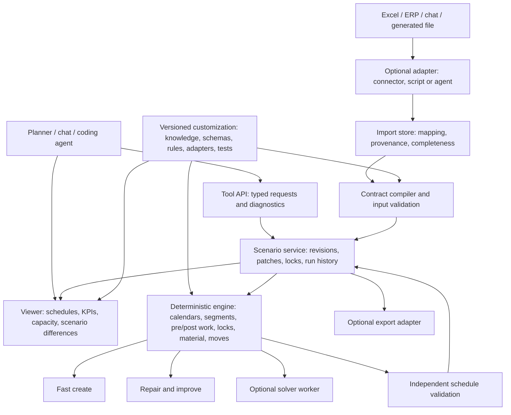
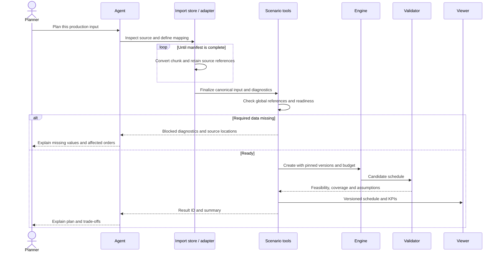
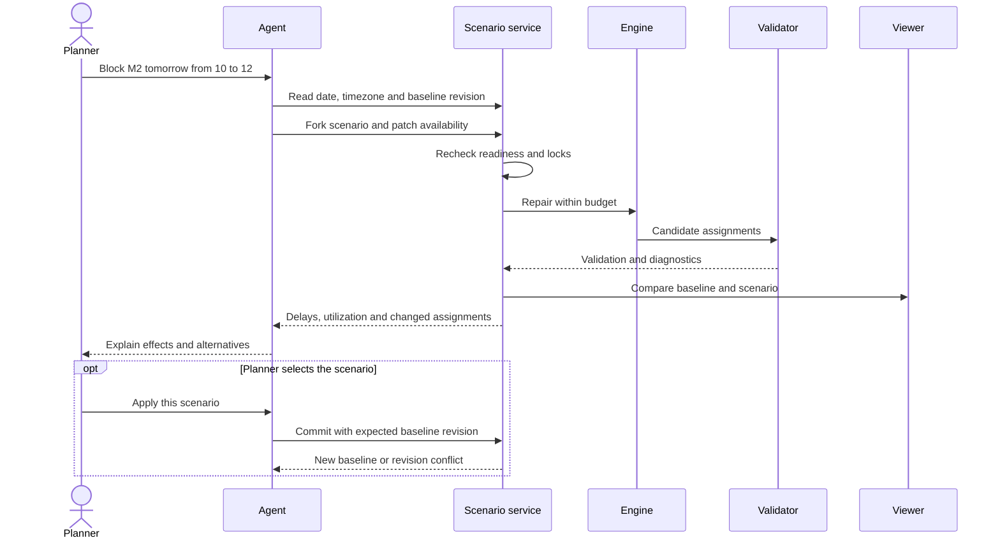
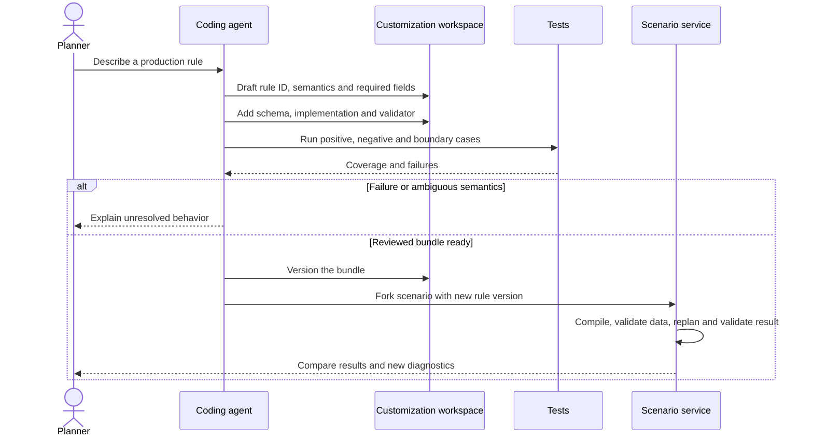

# Target architecture: an extensible production scheduler for agent tools

> Historical source references: the v2 implementation was removed on 24 September 2026. Paths below identify former source files; see the [migration audit](../migration-audit.md).

Target architecture, 23 September 2026. The runnable Rust core, agent tools and viewer are documented separately; see [implemented behavior and limits](../implementation.md). This document also describes capabilities beyond that implementation, including incremental evaluation and future solver integration. Historical Python/Cython reviews remain reference evidence; the source and execution harnesses were removed. All examples are synthetic. See the [accepted core decision](decisions/0001-rust-core.md), [draft input model](input-model.md), [diagram gallery](diagrams.html) and [licensing policy](../../LICENSING.md).

## 1. Recommendation

Build a deterministic scheduling engine with an explicit data contract, independent validation and versioned scenarios. An agent imports data, explains results, proposes changes and develops extensions. Every candidate schedule passes the same validation contract, whether proposed by a heuristic, solver, human or agent.

Keep fast initial construction. Add bounded repair and improvement using shared domain semantics. The existing trainer optimizes heuristic parameters; call this tuning, not validation. Reinforcement learning is an optional experiment, not a prerequisite for interactive planning.

Use Rust for the domain model, decoding, move evaluation, validation and resource calendars. A rewrite alone is not a speed guarantee. Profile the existing Cython/Python pipeline, preserve intended semantics in synthetic reference cases, then compare implementations. The base engine must not require an external solver or Python runtime.

Operational parity is a release gate for the replacement core. Breaks, shift changes, interruptions, pre/post-conditionals, running work, frozen zones, fixed sequences and resource locks are mandatory. The [core semantics contract](core-semantics.md) specifies work segments versus reservations, neighbor-dependent conditional work, orthogonal locks and acceptance cases. These belong to shared engine semantics used by every planner and agent move.

## 2. Research and existing systems

| Source | Design implication |
| --- | --- |
| [PyJobShop paper](https://arxiv.org/html/2502.13483v1) and [model introduction](https://pyjobshop.org/stable/setup/intro_to_scheduling.html) | Jobs, tasks, modes and resources provide a useful scheduling vocabulary. Establish a CP solver baseline. Published benchmark budgets do not establish interactive latency on our data. Keep demand explosion and lot creation separate. |
| [Timefold incremental scoring](https://docs.timefold.ai/timefold-solver/latest/constraints-and-score/performance) and [non-disruptive replanning](https://docs.timefold.ai/timefold-solver/latest/responding-to-change/non-disruptive-replanning) | Use indexed facts, incremental move evaluation, explicit locks and stability penalties. Avoid network calls in the scoring loop. This pattern does not require adopting the Java stack. |
| [frePPLe examples](https://frepple.com/docs/current/examples/index.html) | Resources, alternate operations, setups and inventory interact. Material availability needs temporal semantics, not a generic renewable-resource field. |
| [Microsoft OptiGuide](https://www.microsoft.com/en-us/research/project/optiguide-genai-for-supply-chain-optimization/) | Natural-language what-if questions can be mediated through optimization. The vendor report is a precedent, not a scheduling benchmark for APEX. |
| [SCHEDBench](https://arxiv.org/html/2608.00991v2) | Direct LLM schedule generation can depend on problem representation. Keep constraints machine-readable and validate deterministically; direct-generation results do not evaluate our proposed agent-plus-engine workflow. |
| [LLM4EO](https://arxiv.org/html/2511.16485v3) | LLM-assisted development of evolutionary operators is a possible later research direction, not justification for LLM calls in every search iteration. |

These sources inform a design hypothesis. They do not demonstrate performance or correctness of this repository.

## 3. Existing code: useful concepts and gaps

| Evidence | Consequence |
| --- | --- |
| ResourceList/Allocation (`src/v2/data/workplan_operation.py`, removed) | Preserve alternative resource combinations and partial occupancy. Some class fields are not populated by the standard importer. |
| Trainer (`src/v2/trainer/main.py`, removed) adjusts queue weights using the current instance. | It is parameter tuning, not independent feasibility or robustness testing. |
| Fastplanner (`src/v2/scheduler/fastplanner/fastplanner_default.py`, removed) and insertion (`src/v2/scheduler/fastplanner/insert.py`, removed) repeatedly decode candidates. | Profile evaluation, state reconstruction and decoding before choosing optimization targets. |
| Validation (`src/v2/data/solution/validation.py`, removed) checks sequence properties and counts. | A complete independent validator of final time/resource assignments is still needed. |
| Cython decoder (`src/v2/cython/fastdecoder/fastdecoder.pyx`, removed) has a fallback after unsuccessful multi-resource alignment. | Reusing a master interval cannot prove other resources are available. This static finding needs a reproducing regression case. |
| Preprocessing (`src/v2/preprocessing/preprocessor_default_v2_0.py`, removed) can change a due date based on an earliest start. | Keep requested dates separate from derived planning values. |
| Explorer (`src/v2/scheduler/fastplanner/controller.py`, removed) combines normalized objective values. | Define shared weights, directions and normalization across planners and scenarios. |
| The standard strategy (`src/v2/strategy/strategy_default.py`, removed) and fastplanner caller (`src/v2/scheduler/fastplanner/decode_output_helper.py`, removed) select Cython fast decoding; an OR-Tools path and incomplete CP model builder (`src/v2/decoder/cp_model_builder_default.py`, removed) also exist. | Solver code and an unconditional legacy dependency are present, but CP solving is not selected by the reviewed standard pipeline. Keep future backend integration optional. |

Replace path-mutating `_dir_init` imports with normal packages or Rust crates during the refactor. Give organizational units, items, templates and capacity resources distinct types. Keep APIs and visualization outside the algorithm. The proposed core runs without a customer module; optional extensions depend on the core.

## 4. Module architecture

| Boundary | Initial technology direction |
| --- | --- |
| Domain engine and validator | Rust selected; typed input and compact indexed state. |
| Optional future solver | Versioned backend port; a Python worker calling native CP-SAT is a possible first adapter. OR-Tools lists C++, Python, Java and .NET in its [official introduction](https://developers.google.com/optimization/introduction/get_started). Measure serialization and model-build costs. |
| Tool API | Language-neutral JSON contract, optional MCP adapter; small responses with IDs and pagination. |
| Import/customization | Python or another suitable adapter language; compiled Rust rules where useful. An agent may create the canonical input directly. |
| Viewer | Thin web application rendering versioned outputs and diagnostics. |

Rust traits can support extensions compiled with the engine. They are not a stable cross-version binary ABI. A versioned external protocol or resource-limited WASM boundary may become useful later. Prefer configuration and declarative rules before adding custom code.

The [accepted decision](decisions/0001-rust-core.md) defines typed hook stages, composition, invalidation and validation coverage. Solver conversion must preserve every active hard rule; arbitrary Rust hooks need separate backend encodings. Unsupported rules reject a solver request rather than being dropped during conversion.

## 5. Import, context limits and missing data

An agent can be the source adapter. Inspect schema, units and representative rows first; use an import tool or generated conversion script to process all records. Samples help discover a mapping but do not establish completeness.

For large inputs, process bounded chunks, preferably whole orders with related operations. Persist IDs, source snapshot, mapping version, processed ranges, unresolved references and diagnostics outside chat memory. Retries must be idempotent. Use a manifest/cursor to resume.

Validate locally and globally: types and required fields per chunk; duplicates, cross-chunk references, dependencies and completeness after import. An interrupted import cannot become a complete planning problem. **Import batching is not independent scheduling**: chunks may compete for shared machines, people and material.

Use durable begin/append/status/finalize import sessions with chunk IDs, content hashes, idempotent retries and atomic publication of complete problem revisions. Pass large inputs by artifact reference or bounded chunks. Bound tool responses with pagination and explicit total counts. Import buffering, compiled scheduling state and agent context have separate budgets; the [import contract](decisions/0001-rust-core.md) records these requirements.

| Finding | Behavior |
| --- | --- |
| Required processing time cannot be derived | Block readiness with `DATA_INCOMPLETE`; identify affected tasks, orders and source cells. |
| Time basis, unit or necessary quantity ambiguous | Block until duration has a unique interpretation. |
| Duration estimated using a declared rule | Retain warning, provenance and assumptions in the result. |
| Plausibility limit exceeded | Warn, or error if a binding model limit is violated. |
| Optional description missing | Inform without blocking unrelated computation. |

Missing, null, explicit zero and derived values are different states. Required data depends on active rules and execution state. Completed tasks may have adequate actual timestamps; running tasks require explicit remaining-work semantics. Do not silently drop an alternative or order because its data is incomplete.

Diagnostics carry input revision, code, severity, entity ID, field path, source file/sheet/cell, affected orders and suggested action. Chat may summarize “12 missing durations affect 7 orders”; the complete report remains queryable. Pagination and truncated details must be explicit. Each run checks readiness for its exact input and rule versions.

## 6. Planning operations

| Operation | Purpose |
| --- | --- |
| `create` | Quickly construct a candidate using a deterministic heuristic or small portfolio. |
| `validate` | Independently check final assignments, required-task coverage and active hard rules. |
| `repair` | Restore feasibility after a change while preserving unaffected/locked decisions. |
| `improve` | Spend a bounded budget on local search, LNS or a solver; retain a valid incumbent. |
| `tune` | Optimize heuristic parameters across representative instances. |
| `simulate` | Evaluate execution under explicitly stated disturbances and uncertainty. |

Poor objective quality is not infeasibility; tuning does not repair missing constraints. Track time to first valid plan, quality, stability and rule coverage separately. Try indexed calendars, caching, incremental deltas and bounded neighborhoods before RL.

For “move this task,” an agent submits a typed patch or move. The engine computes consequences, repairs related activities and validates the result. Distinguish infeasible requests, incomplete data, unsupported rules and timeout without a solution.

Evaluate moves transactionally: check locks, update affected resource transitions, regenerate conditional work, place execution segments and reservations, then propagate dependencies and material effects. A change can affect both previous post-work and next pre-work. Incremental evaluation falls back to full recomputation when its dependency scope is uncertain. Independent validation checks final assignments before a candidate is published as valid; failed heuristic repair is not proof of global infeasibility.

## 7. Knowledge and customization

Start with Markdown explanations and rationale. Pair executable rules with stable IDs, versions, schemas, required fields, scope, hardness and examples. Prose alone does not enforce a constraint.

An extension bundle can contain `knowledge/`, `schemas/`, `rules/`, `adapters/`, `tests/` and optional viewer metadata. Declare engine support. Unsupported hard rules block a solve instead of being ignored.

Hooks may enrich the compiled model, propose/rank candidates, evaluate transitions or hard constraints, contribute objective components and explain results. Their typed context includes relevant calendars, resource neighbors, conditionals, execution state and locks. Declare affected data for correct incremental invalidation; contradictory overrides are errors. Extensions propose effects through the same transaction mechanism and require final validation coverage.

Agent-written code follows a development workflow: reviewable specification, positive/negative/boundary cases, rule implementation and validator, interaction tests, then a pinned bundle version. A rule change invalidates earlier readiness and validation results. Runtime planning should not silently modify executable code.

Use declarative viewer metadata for new fields and diagnostics where sufficient.

## 8. Tools and state

Proposed tools include `import.inspect`, `import.map`, `problem.validate`, `scenario.fork`, `scenario.patch`, `schedule.create`, `schedule.repair`, `schedule.improve`, `schedule.validate`, `scenario.compare`, `schedule.explain` and `scenario.commit`.

Keep datasets outside conversation context. Return counts, KPIs, violations, assumptions and artifact references. Support budgets, cancellation, seeds, progress and optimistic revision checks.

A previous schedule is a baseline, not automatically a collection of hard locks. Persist model, input, rule bundle and engine versions. Committing a scenario to the baseline and exporting it to a source system are distinct actions.

## 9. Workflow: create an initial schedule

## 10. Workflow: change and compare through chat

## 11. Workflow: develop a new constraint

## 12. Simulation and thin frontend

Deterministic rescheduling answers a specified what-if input. Stochastic simulation assesses distributions of downtime, processing times, arrivals or yield. They support different claims. A future discrete-event simulator can share calendars, resource semantics and dispatch policies without treating one solve as a robustness test.

The viewer should expose Gantt charts, capacity profiles, tardiness, transition work, inventory, locks, input warnings and scenario differences. Show productive segments separately from elapsed task envelopes and retained resource reservations, including breaks and pre/post activities. Expose the dimensions bound by each lock. The agent can link to a selected resource or violation.

## 13. Implementation sequence

1. Capture the [mandatory operational semantics](core-semantics.md) and known defects using separate synthetic examples.
2. Introduce a canonical contract, provenance and strict readiness checks.
3. Add independent result validation and versioned scenario storage.
4. Profile and port justified kernels to Rust; compare outputs and timings. Replace v2 only when the mandatory semantic cases pass; partial prototypes must expose their limited coverage.
5. Add create, move, repair, improve and compare tools plus a thin viewer.
6. Add versioned customization bundles and a generic adapter example.
7. Evaluate tuning, simulation and advanced search against measured needs.

The commercial model is independent of scheduling volume. Customer revenue and licensing counters do not belong in the canonical planning problem.
