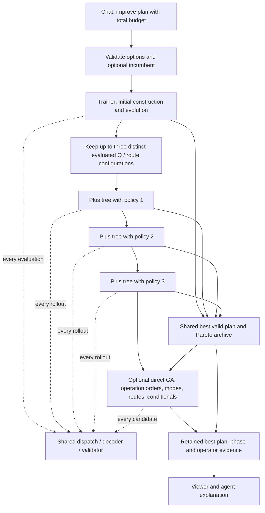

# Combined improvement and the modeling boundary

Initial portfolio implemented in APEX 0.4.1; direct GA added in 0.6. See the [current direct-search contract](../direct-schedule-evolution.md) and [migration audit](../migration-audit.md). The production input remains `apex.v3.4`; the options schema adds `improve`. This document distinguishes implemented behavior from future optimization work.

## Planner-facing contract

The planner asks for a quick plan or an improved plan. The chat agent uses `schedule.create` or `schedule.improve`; it does not ask the planner to select Trainer versus Plus. Individual `schedule.train` and `schedule.plus` tools remain available for explicit diagnostic comparisons. The normal browser remains a read-oriented viewer. The optional workbench has **Quick plan** and **Improve plan**.

Supply the `scenario_id` returned by the scenario tool and optionally a saved `schedule_id` from the same revision. The following example shows the request's `options` object.

```json
{
  "options": {
    "iterations": 128,
    "budget_ms": 5000,
    "seed": 42,
    "trainer": {"population_size": 16, "workers": 2},
    "plus": {"workers": 2, "depth": 8, "branching": 4},
    "improve": {"trainer_share": 0.4, "evolution_share": 0.0, "policies": 3}
  }
}
```

Omit `schedule_id` after changing or forking the scenario. An incumbent must belong to the exact scenario identity and revision, pass independent validation and satisfy any additional requested mode/route/prefix options. This prevents comparing scores from changed objectives. Replay data, metrics and physical constraints remain authoritative. Existing saved results remain readable.

CLI: `apex improve INPUT.json --options OPTIONS.json --out RESULT.json`.

## Actual algorithm



1. Trainer receives 40% of the total evaluation allowance (floor, at least one) and approximately 40% of the remaining time. Its initial population includes the requested constructive strategy, so a separate duplicate baseline construction is unnecessary. An optional incumbent is retained separately.
2. A bounded pool retains the best distinct **evaluated Q configurations and resolved routes** seen during training. With at least two policy slots, the first valid Q configuration is reserved as a reference and explored first: a better greedy score does not imply a better rollout policy. A one-policy configuration uses the best retained seed. Equal objective scores do not remove a distinct configuration. Diversity is structural, not a measured behavioral distance. Classic reference strategies can win the overall run but are not mislabeled as evaluated Q policies.
3. Plus receives each retained policy for both branch ranking and complete rollouts. The seed's actual route configuration is retained. The validated seed is reused without charging a second evaluation. After reserving the GA share, remaining time and evaluations are divided among the remaining seeds, reference first, then elites in score order; unused allowance carries forward. A complete prefix tree is retained within each Plus phase.
4. The direct GA receives the remaining global allowance and a bounded pool of validated schedules from earlier phases. Its operators and discounted-UCB selection are described in the [0.6 contract](../direct-schedule-evolution.md). The default reserve is zero because fixed-share quality ablations regressed. An agent may request a reserve (tested example: 30%) for an explicit three-phase comparison.
5. Every new successful evaluation updates the same incumbent and bounded nondominated archive. Under a fixed model and objective definition, the final score cannot be worse than any valid candidate already observed. This does **not** imply dominance over either standalone search given its own whole budget.
6. If training finds no usable Q seed, Plus still runs from the requested/default policy; a successful classic candidate can remain the incumbent. Failed greedy construction does not prove infeasibility.

The evaluation cap is shared, includes failed complete evaluations and honors `trainer.max_evaluations` as an override for `iterations`. Zero disables an evaluation/time cap. At least one total evaluation/time cap is required; a Trainer generation limit alone cannot bound Plus. Generation limits restrict Trainer and GA separately. With one evaluation, the run can only attempt the initial construction.

Time is **soft**, checked between complete evaluations or worker batches. Initial validation, normalization and portfolio administration count toward the outer elapsed time. One expensive decoder/probe/worker batch can exceed the allowance or consume the entire run before Plus starts. There is no asynchronous cancellation or guaranteed response-time SLA.

With time disabled, deterministic customizations and fixed seed/options/worker counts, runs reproduce their decisions. Plus exploration can change with its worker count. Workers are reused as settings within each phase; phases run sequentially, avoiding nested worker pools and oversubscription. Phase evidence reports evaluations, rejected candidates, elapsed time, stop reason, handed-off policy/routes and the best score so far. Progress retains the first 127 strict improvements and the latest one; it is post-run evidence, not a streaming progress API.

There is no adaptive budget learning, resumed cross-request search, alternating Trainer/Plus feedback cycle or automatic translation of a successful Plus sequence back into Q weights. Those need separate evidence. Q synthesis and stochastic simulation are also not added by this change.

## Why retain constructive scheduling?

Trainer and Plus repeatedly use construction and full validation. A fast constructor is their evaluation engine, a low-cost initial result and a place to deploy previously tested Q policies. Improving it benefits all entry points. Detailed calendars, material timing, running work, fixed decisions and conditional activities share one implementation rather than being reimplemented per search strategy.

The strongest current advantages are a bounded explainable construction procedure, direct integration of domain hooks, explicit operational semantics and reusable agent tools. Optimality, complete feasibility discovery, universally superior quality and universal speed superiority are **not** advantages we have proved.

## Compared with mathematical optimization

| Aspect | Current APEX | CP/MIP mathematical model |
| --- | --- | --- |
| Known requirement | Configure a supported typed rule/template | Add supported variables, constraints and objectives |
| New semantics | Implement typed data, enforcement/evaluation, validation and tests | Express with existing primitives, reformulate, or implement a custom handler |
| Good first result | Specialized constructive pass; can fail despite feasibility | Solver-dependent; modern solvers also use heuristics and can return early incumbents |
| Quality evidence | Valid assignments and measured objectives; no general optimality gap | Bounds, optimality/infeasibility certificates when established by the solver |
| Extension cost | Low for existing templates; potentially substantial for new interactions | Compact modeling can be easier, but formulation and propagation strength affect runtime |
| Detailed operational behavior | Reuses the current calendar/material/conditional decoder | Must be represented faithfully in the mathematical model |

NP-hardness does not by itself justify rejecting a solver. OR-Tools CP-SAT provides interval variables, precedence and no-overlap constraints for job-shop scheduling ([official example](https://developers.google.com/optimization/scheduling/job_shop)). SCIP supports custom constraint handlers and primal heuristics ([constraint handlers](https://scipopt.org/scip/doc-9.0.1/html/group__PublicConshdlrMethods.php), [heuristics](https://www.scipopt.org/doc/html/HEUR.php)). These sources establish capabilities, not an APEX performance comparison. A future backend could optimize a selected subproblem or supply a benchmark oracle while preserving independent validation.

Adding an equation is not yet a general APEX extension mechanism. The current declarative language is a finite, versioned catalog. It should remain the common domain contract; an eventual solver adapter would translate supported semantics rather than silently ignore unsupported rules.

## Extending rules with a planner and coding agent

1. Record the requirement in customization knowledge: units, scope, hard versus soft meaning, exceptions, examples and counterexamples. A next-choice policy is different from a condition on every final schedule.
2. Reuse a typed template where possible. This is a data change, not a runtime code-generation task.
3. For genuinely new semantics, the coding agent modifies the relevant Rust extension or generic core module. Implement readiness, execution/evaluation and independent validation together. Add a Q only if its relationship to the exact goal is understood and tested; an arbitrary objective formula does not automatically provide a useful local heuristic.
4. Run semantic, interaction and corrupted-result tests across the shared construction and combined search. Measure quality and latency on held-out synthetic cases; preserve failures and regressions.
5. Version and rebuild the extension, then activate it on a scenario and compare saved results. Runtime tool input cannot execute source text. The coding agent can perform this workflow in the repository; APEX does not hot-load untested code or update a production service itself.

This lets the planner develop a living codebase through an agent without exposing algorithm selection or Rust internals in the ordinary planning conversation.

## Open item: automatic Q-formula generation

**QGEN-01 — Open; recorded 24 September 2026. Research and design backlog only; not implemented or scheduled.**

Explore generating new Q formulas or complete dispatch priority functions from a bounded set of features and operators. The current Trainer changes weights, normalization and routes; it does not invent new formulas. Formula generation would extend that search space to conditions and nonlinear interactions. An objective definition alone does not imply an effective local priority formula.

First investigate the existing Q policies and Trainer/Plus coupling. A policy's constructive score and its usefulness for subsequent Plus exploration can differ. Formula synthesis should be assessed as an additional experiment after establishing that baseline.

### TODO

- [ ] Define a small typed expression language with explicit feature availability, units or normalization, score direction and process-stage scope. Candidate inputs include slack, processing work, setup effort, material readiness and resource load. Use only information available at the decision being evaluated.
- [ ] Specify bounded operators such as arithmetic, protected division, minimum/maximum and conditions, including missing-value behavior, finite-value checks and expression size/depth limits. Candidate formulas should be data evaluated by the Rust core, without requiring a Rust rebuild for every candidate.
- [ ] Compare candidate proposal mechanisms, initially agent-proposed expressions and optionally genetic programming. Keep formula generation separate from the existing weight Trainer; neither reinforcement learning nor unrestricted source-code execution is required by this proposal.
- [ ] Evaluate candidates through shared dispatch, placement and independent validation using the actual schedule objectives. Compare fitness from constructive runs with fitness from short Plus runs; account for all search and evaluation costs.
- [ ] Test on separate development and held-out synthetic scenarios, multiple seeds, problem sizes and relevant constraint interactions. Check behavioral diversity, expression complexity, numerical edge cases and reproducibility.
- [ ] Define promotion and regression criteria before tuning: feasibility, actual objective quality, time to quality, runtime overhead and interpretability. Version accepted formulas with their feature contract, objective context, provenance, test evidence and a fallback to an established policy.

### Acceptance and boundaries

Hard constraints and mandatory dispatch policies remain authoritative. Generated priorities may rank admissible choices; they cannot relax constraints or change the objective being used to judge a plan. Numeric failures must produce defined diagnostics or fallback behavior rather than silently affect ranking.

Compare against the current fixed Qs, weight-only Trainer and combined improvement with matched end-to-end budgets. Report formula-discovery cost separately from reuse cost, and compare downstream Plus runs with equal Plus budgets as a separate experiment. Publish regressions and failures as well as improvements; no quality, speed or generalization benefit is assumed.

Open design decisions include generating an individual Q versus a whole priority function, per-scenario versus reusable training, the expression representation, and how much Plus feedback is affordable. This item does not add a general mathematical constraint compiler, runtime Rust code generation or a self-modifying production service.

## Direct schedule evolution and adaptive operators

**GA-01 — Baseline implemented in 0.6 (24 September 2026).** Direct priority chromosomes, mode/workplan/conditional genes, elitist population, job-order crossover, uniform and discounted-UCB operator selection, versioned native proposal hooks and an optional final shared-budget GA phase are implemented. See [semantics](../direct-schedule-evolution.md), [tests](../../tests/evolution.rs) and [migration boundaries](../migration-audit.md).

The legacy references were `src/v2/scheduler/deepsearch/mutation_default/mab.py` and `src/v2/scheduler/deepsearch/crossover.py`. The Rust design deliberately discounts both counts and rewards and credits one operator per candidate. It does not copy temperature annealing or claim behavioral identity with the legacy GA.

Remaining extensions: dedicated bottleneck/setup-focused operators, behavioral diversity beyond distinct chromosomes, cost-normalized/adaptive phase allocation, incremental evaluation and arbitrary-start-time neighborhoods. These are not required to use the implemented GA and are not silently represented as completed V2 parity. Uniform-versus-bandit and shorter-pipeline comparisons remain part of performance acceptance, not a claim that three stages always win.

## Open item: automatic mutation and crossover generation

**OPGEN-01 — Open; recorded 24 September 2026. Follow-up to a tested GA-01 operator interface; not implemented or scheduled.**

Explore agent-proposed or automatically generated schedule-change operators, in addition to [Q-formula generation](#open-item-automatic-q-formula-generation). A Q proposes which constructive choice is promising; an operator proposes how to change an existing solution. The bandit selects among available operators based on observed outcomes; it does not itself synthesize new operators.

### TODO

- [ ] Define a bounded operator representation or tested Rust extension contract, with preconditions, affected decisions, complexity limits, seeded randomness and observable outcomes. Decide whether candidate operators compose existing moves or require new native semantics.
- [ ] Let a development agent propose domain-specific mutations and crossover variants, such as moving a compatible campaign block or rerouting a bottleneck operation with its conditional activities. Treat these as hypotheses to test rather than inferred guarantees from an objective.
- [ ] Validate proposed operators on semantic, negative, interaction and corrupted-result cases. Check hard commitments and policy replay, then evaluate quality, failure rate, cost and behavioral novelty on held-out scenarios.
- [ ] Version accepted operators and introduce them into the bandit's portfolio with explicit exploration and fallback. Keep operator-generation cost separate from scheduling/reuse cost and preserve attribution across operator versions and objective/model changes.
- [ ] Compare fixed, adaptive and expanded operator portfolios before promotion. Native code proposals follow the repository test/build workflow; runtime tool input does not execute arbitrary generated Rust.

Recommended progression: establish V2 migration semantics, implement a small direct-search baseline, measure adaptive operator selection, then investigate Q/operator synthesis. Neither a larger portfolio nor a three-stage search is assumed to improve results without evidence.

## Evidence

See the [search semantics](../search-and-parity.md), [declarative model contract](declarative-scheduling.md) and [combined-improvement tests](../../tests/improve.rs). Quality comparisons require identical total nominal budgets, reported overruns and actual schedule objectives; simply spending both standalone budgets would not establish an advantage.
