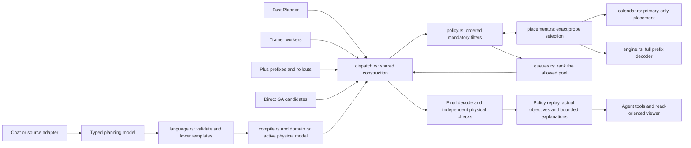
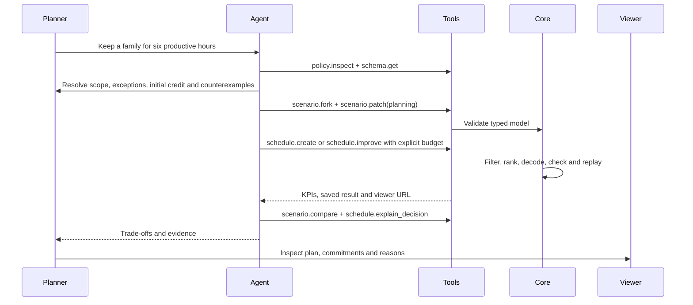

# Declarative scheduling

Current contract for APEX 0.6. The executable input version is `apex.v3.4`; canonical v3.1–v3.3 inputs remain accepted. `planning.version` is `apex.planning.v1`. This is a bounded typed vocabulary, not an expression interpreter or general mathematical solver. The [architecture map](README.md) explains the modules and shared evaluation flow.

## Three contracts

| Input | Meaning | Enforcement |
| --- | --- | --- |
| `planning.constraints` | Physical restrictions that every output must satisfy | Lower into existing modes, windows and locks; use existing independent validation |
| `planning.policies` | Which eligible decision may be taken next | Ordered mandatory filters over the complete ready task/mode pool; deterministic policy replay |
| `planning.objectives` | Additional weighted completion metrics | Lower into an evaluated attribute objective and its existing Smith-ratio Q proxy |

Existing calendars, material flows, conditional operations, execution records, routes, dependencies, locks and objective definitions remain available. The language composes those tested primitives; it does not replace them with less expressive structures.



## Vocabulary

Selectors have `tasks`, `families` and `stages`. Empty fields are wildcards; populated fields are combined with AND, values within a field with OR. Selectors use exact strings; no hidden fuzzy matching occurs.

- `eligible_resources`: intersect the modes of selected tasks with a declared resource list. Several rules intersect. A task with no remaining mode is an error.
- `window`: add an earliest main start and latest product release for selected tasks, in seconds. Existing tighter bounds remain binding.
- `sequence`: use the existing resource order lock, optionally consecutive. It does not become a product-release dependency.
- Completion objective: `id`, selector, optional nonnegative task `attribute`, nonnegative `weight`, and `priority`. It evaluates the sum of coefficient times product-ready time. Omitted attribute means coefficient one; unmatched tasks get zero. The generated numeric attribute is `__planning:ID`, the metric is `ID`, and the Q is `attribute:ID`. Input collisions are rejected. Standard objective overrides still control direction/scale/priority.

The automatic Q divides the coefficient by estimated work and conditional work. It is the Smith ratio for the corresponding simple single-machine problem. Calendars, releases, dependencies, alternative modes and competing goals turn it into a heuristic; adding an arbitrary metric does not synthesize a trustworthy proxy.

```json
{
  "planning": {
    "version": "apex.planning.v1",
    "constraints": [
      {"kind":"eligible_resources","id":"coating-cell","select":{"stages":["coat"]},"resources":["COAT-1","COAT-2"]}
    ],
    "policies": [
      {"kind":"campaign","id":"six-hours","resource":"COAT-1","select":{"stages":["coat"]},"minimum":21600,"basis":"productive_time","initial":{"family":"A","credit":0},"on_no_match":"allow_switch","urgent_slack":900,"exempt_committed":true}
    ],
    "objectives": [
      {"id":"service_completion","select":{"stages":["coat"]},"attribute":"service_weight","weight":1,"priority":0}
    ]
  }
}
```

This snippet needs matching resources, tasks, families and explicit coefficients. The runnable [synthetic example](../../examples/dispatch-campaign.json) is complete.

## Mandatory dispatch policies

Policies run in input order. Each receives candidates still permitted by earlier policies, static locks, dependency readiness, active consecutive blocks and explicit mode choices. With any mandatory policy enabled, a 64-task Q window cannot hide a matching continuation: the full eligible ready pool is inspected. Construction stage preference is applied afterwards. A supplied decision prefix must also survive these checks. Policies apply even to a singleton pool.

| Policy | Contract |
| --- | --- |
| `campaign` | Restrict family switches until `minimum` credit is reached; `continue_after_minimum` optionally retains a matching family beyond that minimum. `on_no_match` must explicitly allow a switch or report a conflict. |
| `idle_gap` | Compare exact next main start with the previous primary-resource occupancy end. `fallback_to_smallest` explicitly permits the smallest feasible gap when none fits `maximum`; otherwise report a conflict. |
| `urgency` | When exact main completion leaves due-date slack at most `slack`, restrict this resource to those urgent candidates. A soft due date remains soft. |

A matching campaign continuation may start later because of release times, calendars or material receipts. If waiting must be limited, put an explicit `idle_gap` policy before the campaign rule.

Campaign scope selects the candidates controlled by the rule. Campaign history is the contiguous family suffix of **all chosen work on that primary resource**, including work outside the candidate selector. Work on other resources is untouched. To scope independent campaigns, model their physical resource identities explicitly.

Campaign credit bases:

- `work`: actual main-segment work, including observed execution and the decoded remainder.
- `productive_time`: elapsed seconds in main/actual segments, excluding breaks and pre/post activities. A rate of two means two work units in one productive second.
- `occupied_time`: the union of primary-resource reservations, including retained pauses and conditional work, per operation.
- `elapsed_time`: first main start to last main end of the contiguous family suffix, including intervening idle time and breaks.

`initial.credit` represents history outside the supplied operations; do not also encode that same work as an execution record. With no initial state, the first selected task starts the campaign. Once a different family is selected, initial credit no longer applies. Missing family and processing information is an error, not an inferred zero.

`urgent_slack` and `exempt_committed` are optional campaign exceptions and default to no exemption. An exception does not override resource eligibility, a fixed start, a deadline, material balance or any other physical restriction. Without an exception, a policy and a commitment can conflict; the result is a diagnostic, not silent relaxation.

These are **construction policies** evaluated against the prospective selected prefix. They are not unrestricted mathematical predicates on every alternative final schedule. In particular, arbitrary future cross-resource decoration can alter earlier placements; policy replay proves the declared construction procedure, while the separate physical validator checks the final schedule. A domain requirement about an invariant of all final campaign intervals needs an explicit final-schedule constraint/evaluator, not a relabelled dispatch preference.

## Exact placement and native extensions

`placement.rs` chooses a capability-checked fast path for independent tasks with one phase, one capacity-one primary resource, no running execution, dependencies, material flows, conditionals, transitions or native extension. It reuses `calendar::place`, including breaks, rates, retention and fixed starts. It caches only committed resource/campaign state. Differential tests compare this path with complete prefix decoding on varied inputs.

All other cases reuse the existing decoder on `prefix + candidate`. This deliberately recomputes predecessor post-activities and any dependent resource/material effects. Terminal cleanup is deferred until final decoding; it cannot satisfy an unfinished campaign minimum. At most 100,000 full-prefix probes are allowed per construction/replay; exhaustion is a budget diagnostic, not proof of infeasibility. The ready pool itself is not truncated to satisfy this budget.

The `Customization` trait exposes four dispatch-filter hooks:

```rust
fn has_dispatch_policy(&self) -> bool;
fn dispatch_needs_placements(&self) -> bool;
fn supports_prefix_decoration(&self) -> bool;
fn filter_candidates(&self, context: &policy::Context<'_>)
    -> Result<Vec<policy::Rejection>, Diagnostic>;
```

The context contains the problem, selected order/modes, complete eligible pool and optional exact placement facts. A filter may reject supplied task/mode pairs with reasons; it cannot inject tasks or overwrite physical constraints. Invalid or duplicate rejections fail explicitly. Native hooks are deterministic, versioned, statically linked and `Send + Sync`. Trainer, Plus and direct GA invoke them through shared evaluation in each worker. `search::plus_customized` also supports a supplied Rust implementation.

Exact dispatch with a native sequence hook requires `supports_prefix_decoration = true`. This is a developer contract that must be tested: decorations must be meaningful on every prefix and cannot require unknown future tasks. Arbitrary complete-sequence logic remains usable without exact dynamic policies; unsupported combinations fail. There is no runtime evaluation of Markdown, Rust snippets or arbitrary formulas.

## Replay, agent tools and viewer

A governed result stores a SHA-256 fingerprint of the active model and extension identity, pinned options, complete chosen order/modes and a bounded explanation trace. Final validation checks physical constraints independently, reconstructs the decision procedure, compares explanations/counters and decodes the witness to verify assignments. Removing a witness, bypassing a filter, changing the model or corrupting explanations/assignments is rejected. The fingerprint is an integrity reference, not a digital signature or optimality certificate.

Detailed traces retain the first 256 decisions, up to 32 distinct reasons per decision, eight example exclusions per reason and bounded reason text. Full order/mode witnesses remain available through paged `artifact.read`. Counters distinguish direct calendar placements from complete prefix probes.

- `policy.inspect`: inspect the language, current ordered policies, limits and extension workflow.
- `scenario.patch` with `kind: "planning"`: replace the typed planning block on a fork with optimistic revision checking.
- `queues.inspect`: inspect the **lowered** objective-to-Q mapping.
- `schedule.explain_decision`: inspect a task or zero-based construction position from the immutable saved result.
- `model.page`: page `policies`, `constraints` and `planning_objectives`.

The viewer shows readable policy descriptions under commitments/rules, derived sequence/resource badges and explanations on selected operations. Scenario creation and rule changes stay in chat. Both stdio and HTTP expose the same 32 tools.



## Acceptance and limits

The [dispatch tests](../../tests/dispatch.rs) check policy enforcement, replay and rejected/corrupted cases. The [migration audit](../migration-audit.md) records the historical v2 boundary. New restrictions change the admissible decisions and can worsen a previous objective: their cost is measured separately. Neither a benchmark nor passing tests prove universal runtime/quality parity.

General indexed witness queries, transactional rollback of arbitrary cross-resource suffixes, learned proxies, automatic metric compilation and external solvers are not implemented. Whole problems remain in memory; agent transport batching does not remove this runtime bound. See the [architecture limits](README.md#current-limits).
