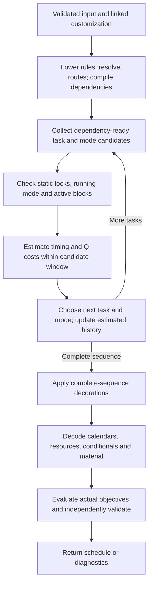
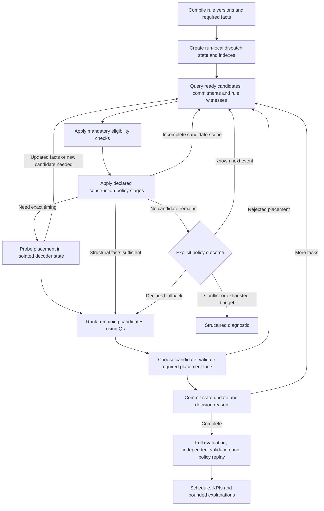
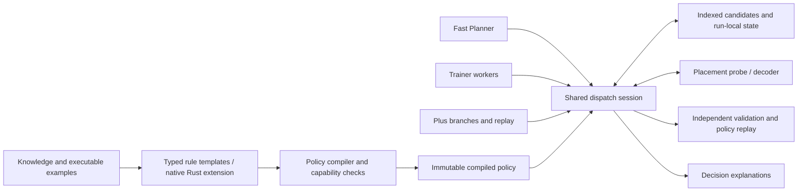
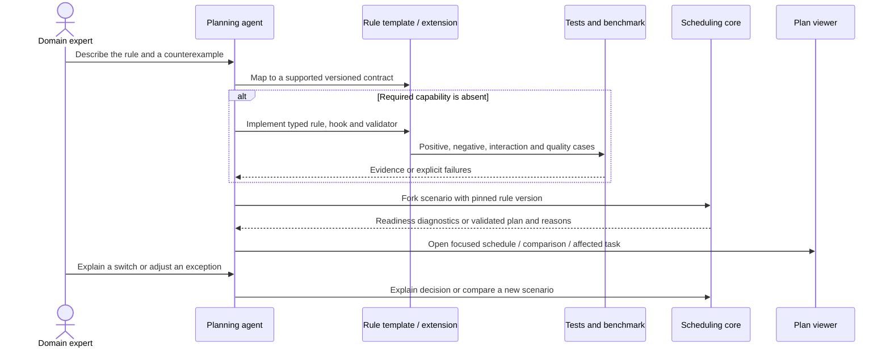

# Original dispatch-policy design and remaining roadmap

Status update, **24 September 2026**: the bounded first implementation is available in APEX 0.4. Read the [current language and module contract](declarative-scheduling.md) and [measured acceptance report](../reports/v0.4-declarative-scheduling.md). Shared filtering, exact probes, prefix enforcement, replay, tools and explanations are implemented. General indexed witness queries and transactional rollback remain roadmap items.

The sections and diagrams below preserve the **23 September design proposal** for comparison. Statements about the old current algorithm refer to 0.3; planned APIs are not necessarily the final API. The [legacy audit](../reports/dispatch-policy-audit.md) establishes the original migration gap.

Open the [visual overview](dispatch-policy.html) for the four diagrams as a local, self-contained page.

## Decision

Introduce one shared dispatch session for Fast Planner, Trainer and Plus. It combines typed domain restrictions, explicit construction policies, Q ranking and, where required, exact placement checks. Domain experts express a rule and its exceptions through chat; an agent maps it to a supported template or implements a versioned Rust extension with executable examples. The viewer explains the resulting decisions.

Do not make every business preference a hard exclusion. Restrictions reduce the search space and can force longer schedules or a dead end. Use an actual objective and a Q proxy when trade-offs are intended; use a mandatory restriction only when that trade-off is forbidden. A domain-approved construction policy can enforce a preferred pattern with explicit exceptions without claiming that every other schedule is physically impossible.

## Pre-migration algorithm (0.3)

- [Decision construction](../../src/rust/engine.rs) maintains dependency counts, resource histories, estimated tails and selected modes. The default Q window is 64 ready tasks plus their modes. Static resource/mode restrictions apply before ranking. Stage ordering and running/fixed choices have special handling.
- [Q estimates](../../src/rust/queues.rs) incorporate selected timing and conditional signals, but are not the exact occupancy/material simulation. A dependency-ready task is not necessarily immediately executable.
- [Sequence decorations](../../src/rust/extensions.rs) receive the complete selected resource sequence, including future neighbors. They run after order/mode construction and before exact decoding.
- [The final decoder and validator](../../src/rust/engine.rs) enforce the implemented schedule semantics. A failed construction can miss an otherwise feasible plan.
- [Trainer](../../src/rust/search.rs) evaluates complete schedules while evolving Q weights and routes. Plus explores task/mode prefixes using UCT and complete rollouts. Both already reuse the schedule evaluator, but prefix handling, classic strategies and branch enumeration are distinct paths inside construction.

Two integration hazards matter: a forced prefix currently bypasses Q candidate collection, and `next_choices` currently obtains branches by running complete decision construction. Plus also converts expansion errors into an empty choice list. A new filter must cover prefix replay, enumerate a valid next step without requiring a successful suffix, and preserve failure diagnostics.

## Three distinct contracts

| Contract | Plain-language question | Enforcement | Can search change it? |
| --- | --- | --- | --- |
| Feasibility constraint | Is this schedule allowed? | Conservative early rejection where possible, exact checks and independent final validation | No. A changed constraint creates a different scenario. |
| Construction policy | Which allowed operation may be selected next under this policy? | Candidate restriction with explicit scope, order, exceptions and fallback; deterministic replay | Policy stays pinned during a run. Only explicitly exposed tuning parameters may vary within declared bounds. |
| Objective and Q proxy | Which allowed choice is promising, and which complete result is better? | Q guides construction; actual schedule metric decides fitness | Trainer can evolve permitted heuristic parameters; the declared objective remains fixed for comparable results. |

Static product-to-machine restrictions should lower to existing modes/locks. A campaign rule that depends on already chosen work needs the new policy layer. Sequence-dependent cleaning remains a physical activity/transition, even if avoiding that cleaning is also an optimization goal. A hard rule must never be implemented only as a large penalty.

## Target algorithm and insertion points

Exact probes can be lazy for candidate-local tests, but must occur before any pool-wide fallback that depends on their results. For example, "no executable continuation exists" requires checking the complete relevant scope, not just the highest-ranked continuation. Each retry must discover a new candidate, refine an unknown fact, or advance to a known event; otherwise report a diagnostic. The number of probes and queries is budgeted, and exhausting that budget is not evidence of absence or infeasibility.

### State accuracy is part of the rule contract

The first increment supports structural policies using selected modes, family history and explicit nominal quantities. It must reject policies asking for exact temporal facts until those facts are supported. An estimate may guide a Q; it cannot certify a mandatory temporal condition.

For example, "six hours of the current family" is ambiguous. It can mean nominal work, productive elapsed main-operation time, primary-resource occupied time including setup, or elapsed wall time including breaks. A typed duration basis, treatment of running work, campaign boundaries and initial campaign snapshot are mandatory. Missing required duration/family facts produce actionable diagnostics rather than defaulting to zero or an empty family. Partial historical campaign state must be supplied or explicitly assumed in the pinned input.

### Exact placement and existing sequence hooks

Introduce `PlacementProbe`/commit/rollback by extracting placement logic from the existing decoder, rather than writing a second temporal simulator. Reuse calendar, resource and material semantics. Keep independent validation independent of construction decisions.

The complete-sequence `sequence` hook creates a real dependency problem: appending a task can change its predecessor's post-work, or an arbitrary extension can inspect still later tasks. A previously decoded prefix is not always stable.

Declare extension dependencies explicitly:

- **Prefix-stable:** earlier placements do not change after appending; incremental state can be reused.
- **Bounded predecessor effects:** appending can change a declared suffix. Roll back from the earliest affected assignment, including dependent resource/material effects; that closure can exceed the local machine suffix.
- **Complete-sequence effects:** retain full decoration/decoding. Reject exact state-dependent policies in the first implementation when their required facts cannot be established causally. Do not label a provisional prefix as exact. A later bounded replay/fixpoint design requires separate evidence and convergence handling.

The full evaluator remains the oracle for incremental equivalence. Terminal post-effects need explicit finalization. A disagreement between probe and final decoding invalidates the candidate; it must never silently pass.

## Proposed module and hook contract

The following names describe the planned API, not existing exports.

| Planned change | Responsibility |
| --- | --- |
| `model.rs`, schemas and `compile.rs` | Typed policy specs, duration basis, scope, exceptions, required fields, initial state, version/capability validation. Add a schema version only with the implementation. |
| `dispatch/state.rs` | Run-local selected modes, resource histories, campaign counters, stage/dependency readiness, commitment state and fact accuracy. |
| `dispatch/candidates.rs` | Indexed ready-pool queries, stable candidate IDs, scope-completeness evidence and widening. |
| `dispatch/policy.rs` | Compiled built-ins and native policies; ordered composition, candidate masks, bounded reason codes, explicit fallback/conflict handling. |
| `dispatch/placement.rs` | Transactional exact probes and event advancement; decoder reuse and invalidation rules. |
| `dispatch/trace.rs` | Compact decision evidence and on-demand explanation replay. |
| `engine.rs`, `search.rs` | All strategies, forced prefixes, next-choice expansion and evaluations call the same dispatch contract. |
| `validate.rs`, `extensions.rs` | Schedule-level constraint verification, deterministic policy replay and extension-version checks. |
| `service.rs`, viewer | Proposed policy inspection and decision-explanation tools; concise rule and commitment details in the existing viewer. |

A native policy declares its required facts and candidate scope, then restricts candidates using a read-only context. Its result can retain a subset, request a scoped query/probe, or report a structured conflict. It cannot add an unknown task/mode, rewrite the input, mutate global state, or restore a candidate rejected by a feasibility constraint. The engine owns commits and run-local state updates. Compiled policies are immutable and `Send + Sync`; each parallel evaluation/branch has separate state.

Use typed templates for common policies such as compatible-family continuation, bounded program switching and maximum acceptable idle gaps. Native Rust covers behavior that the templates cannot express. A small typed vocabulary is preferable to a general language hidden in JSON. No LLM/network calls occur in the per-candidate loop.

### Composition, precedence and commitments

1. Enforce mandatory constraints and existing commitments together. A conflict between two mandatory requirements is an explicit conflict, not a priority contest.
2. Apply policy stages in a declared order. Within a stage, restrictions intersect; competing preference groups require explicit precedence. No implicit "last hook wins" behavior.
3. Express urgency exceptions and no-continuation fallbacks inside the relevant policy contract. An urgency exception cannot override a mandatory resource/calendar/material condition. Whether urgency precedes an idle-gap preference is visible configuration, with a legacy-compatible option tested separately.
4. Existing running/frozen work is never rewritten silently. A construction policy may explicitly exempt committed decisions; otherwise a conflict is reported. Mandatory constraints still validate committed work under their declared scope.
5. Normalize and combine Qs over the final retained candidate pool. This deliberately differs from v2's normalize-then-filter order and needs quality comparison; semantic migration does not require identical heuristic scores.
6. Validate every forced prefix against the same policy and pinned state. Search prefixes are replay instructions, not authority to bypass a rule.

An empty set means one of several things: incomplete query coverage, currently unavailable work, contradictory requirements, policy rejection of a branch, or exhausted search/probe budget. Give these distinct reason codes. A construction fallback may select a different family only if that fallback is part of the rule. A wait action needs a known future release/material/calendar event and a progress check; do not advance an arbitrary global clock or invent material/orders. Report "no plan found under this policy/budget" when mathematical infeasibility is unproven.

## Efficient candidate handling

The 64-task window is a ranking optimization, not the meaning of "no compatible candidate exists." Maintain indexes by stage, primary resource, family and readiness; rules declare the queries they need. Seed the rankable pool with mandatory/committed choices and witnesses found by policy queries before filling its ordinary top-k window. Multiple allowed modes remain separate candidates.

A structural index can prove structural absence. Proving absence of a temporally executable continuation may require many exact probes. Widen lazily and cache results against all state dependencies; invalidate on relevant commits. If complete proof is too expensive within the budget, return an explicit incomplete-search diagnostic rather than taking a fallback that assumes absence. Custom predicates without an index may require full scans; report that cost instead of promising sublinear evaluation for arbitrary code.

Define the witness universe before applying a pool-dependent policy: candidates must satisfy mandatory eligibility and applicable earlier stages, but not the policy's own exclusion. Otherwise "no continuation exists" can become circular. Distinguish a witnessed continuation from proof that none exists; only a complete relevant query can establish the latter.

No-policy calls should keep a minimal fast path. Compile selectors and static mappings once per immutable scenario/route configuration where valid. Update campaign aggregates on commit rather than rescanning the entire sequence. Reuse stable indexes, candidate buffers and masks; avoid copying the whole model per candidate. Key caches by input/rule version, route choices, selected modes and relevant state. Plus should first use deterministic prefix replay; persistent state snapshots are an optimization after correctness, with measured memory bounds.

## Domain-expert experience

Keep the default experience in chat. The viewer stays focused on the schedule, comparisons, commitments and explanations.

Example requirement: "Keep the current family on line L1 for six productive hours when executable continuation work exists; allow a defined urgent-order exception." The agent presents one readable rule card: scope, counted time, exceptions, behavior when nothing fits, and treatment of fixed/running work. It asks only about consequential missing semantics. Required source-field gaps are listed with examples and affected task counts; the system does not manufacture processing times.

Existing typed parameters should be editable without compiling new code. Novel semantics require an agent-generated code/test change and a rebuild. Knowledge Markdown records intent and examples; executable code enforces it. Keep a rule's prose, typed parameters, evaluator, optional Q proxy, tests and version together. An actual objective needs an actual schedule metric; a filter does not automatically become a useful Q.

Proposed tool surfaces are `policy.inspect` and `schedule.explain_decision`. They are not available yet. Return bounded summaries and artifact references, using the current paging model. Store rule version, chosen task/mode, decisive reason codes, scope coverage and replay identity; avoid storing every rejected candidate at every step. Recompute detailed explanations on demand from a pinned input and decision witness. A trace alone is not a validity certificate.

Replay identity includes the input revision/hash, executable build identity, extension/policy versions, route/mode choices, seed and relevant options. An edited local extension must not silently revalidate an old plan under the old version label. Retain the applicable build or report that exact replay is unavailable.

Typical explanations: "Family B deferred: a feasible A continuation exists and productive campaign time is below the threshold"; "Switch allowed: no continuation found after a complete scoped check"; or "New rule conflicts with the frozen next operation." Show the rule and affected operation in the viewer; keep technical indexes and Q tuning in an optional diagnostic view.

## Delivery order and acceptance gates

| Increment | Deliverable | Acceptance gate |
| --- | --- | --- |
| 1. Common next-step contract | Extract dispatch session, unify classic/Q/prefix/Plus paths; enumerate one step without constructing a suffix; preserve diagnostics. No new business rule yet. | Existing regression suite passes; no-policy decisions and fixed-budget replay remain stable except separately documented fixes. |
| 2. Structural policy hooks | Typed scope/requirements, native restrictions, indexed coverage, reasons, composition; synthetic family-continuation example. | Same rule works in all strategies and all three planners; forbidden prefixes rejected; candidate 65 discovered; empty/conflicting pools explained. Exact-time policies fail readiness until supported. |
| 3. Temporal campaign semantics | Decoder-backed probes, running/initial campaign state, typed duration basis, causal sequence-hook support and bounded event handling. | Probe/full-decoder equivalence on breaks, rates, material, pre/post work and affected predecessors; unsupported noncausal combinations rejected explicitly. |
| 4. Domain workflow and legacy acceptance | Typed templates, knowledge/examples, rule cards, explanation tools, viewer details and synthetic legacy behavior matrix. | Expert can add a supported policy in chat, see a missing-data diagnostic, compare a scenario and explain a decision. Intended old behavior and deliberate defect corrections have separate tests. |
| 5. Quality and performance tuning | Benchmark indexed filters, probes, Q mappings, parallel Trainer and Plus; optimize only measured bottlenecks. | Report feasibility, objectives, runtime, memory and failure modes under comparable rules and budgets; enable defaults only after these results. |

Do not claim temporal legacy parity after increment 2. Acceptance of the audited campaign/downtime behavior requires increment 3 and its explicit exception order. The old future-due object-type defect must receive an intentional semantic decision and regression case, rather than being copied silently.

### Required tests

- Single candidate, no candidate, candidate beyond the Q window, multiple modes, overlapping policy scopes, mandatory conflict, explicit fallback, urgency and stage scope.
- Every classic strategy, Q dispatch, Trainer mutation/crossover, Plus expansion/rollout, forced-prefix replay and persisted revalidation. Search must not optimize a forbidden filter away.
- Running campaign, unknown initial campaign state, mid-task rate change, shift break, retained resource, alternative route, independent post-work, sequence-dependent predecessor cleanup, material waiting and frozen sequence.
- Corrupt chosen mode, resource, order, duration, policy version, metrics or stored trace. Revalidation derives facts from input and assignments/witnesses, not stored counters.
- Determinism with fixed seeds and evaluation budgets: Trainer across supported worker counts; Plus with the same worker count. Time-limited runs can differ. Rule state must not leak across workers or branches.
- Randomized small cases checked against simple exhaustive enumerators where feasible, including valid schedules the greedy construction misses. Tests distinguish an invalid schedule, a rejected construction policy and failure to find a plan.

### Evidence for efficient, useful plans

Benchmark synthetic workloads at 1k, 10k and 100k operations: sparse and dense readiness, many families, alternative modes, scarce material and frozen prefixes. Include adverse cases where almost all candidates fail a policy. At 100k, bound search budgets explicitly rather than implying every search configuration is cheap.

Compare the no-policy baseline, equivalent soft-Q guidance, indexed mandatory policy, and exact-probe variants. Compare objective values only under the same goal definition and disclose when policy changes narrow the feasible search space. Measure valid-result rate, actual objective vectors/Pareto trade-offs, runtime median/p95, peak memory, evaluations per second, candidate/probe counts, conflicts and fallback frequency.

Use fixed evaluation budgets and multiple seeds for algorithm quality, then equal wall-time budgets for operational performance. Test workers 1 and 4 with time disabled for reproducibility, then measure realistic latency separately. Evaluate new Qs on held-out cases using rank correlation and regret, and retain counterexamples. Correlation is evidence about a heuristic, never enforcement of a constraint.

A provisional engineering gate is less than 10% median no-policy runtime overhead on the stable benchmark suite; confirm run-to-run variation before applying it. Policy-enabled latency and memory budgets should be set from those measurements and the desired scenario turnaround. These are targets, not measured results. A mandatory policy may worsen makespan or tardiness; report the trade-off rather than hiding it behind a faster runtime.

## Scope of this planning change

Runtime code and schemas remain unchanged. The companion interactive explanation uses synthetic candidate costs and scenarios; it demonstrates the proposed decision contract, not measured schedule quality or an executable Rust feature.
