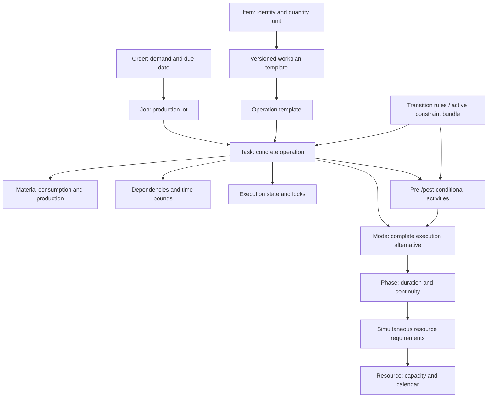

# Draft input model for domain validation

> Historical source references: the v2 implementation was removed on 24 September 2026. Paths below identify former source files; see the [migration audit](../migration-audit.md).

Draft 0.1, 23 September 2026. This is a proposed contract for discrete production, not an implemented schema. The [synthetic JSON](input-model-example.json) uses `3.0-draft.1` and cannot be passed to the legacy v2 importer. The v2 demo (`src/v2/customization/dummy_customer/README.md`, removed) is separate. See the [architecture](agentic-scheduler.md) for module boundaries.

The current Rust runtime uses `apex.v3.4`; read the [executable data-model reference](../data-model.md) and [operating guide](../implementation.md). This earlier template-oriented proposal remains design context and is not accepted by the Rust importer.

Distinguish supplied facts, decisions the scheduler may make and rules every result must satisfy. Breaks, shift changes, interruptions, pre/post-conditionals, running work and precise freeze/sequence/resource locks are mandatory replacement-core capabilities. The [core semantics contract](core-semantics.md) defines their behavior and synthetic acceptance cases; this remains a proposed model, not implemented coverage.

## 1. Domain objects



| Object | Meaning |
| --- | --- |
| Organization unit | Site or department; organizational grouping is not machine capacity. |
| Item | Material, intermediate or finished product with an explicit quantity unit. |
| Order | Demand, requested due date, priority and optional hard deadline. |
| Job | A production lot serving demand. Lot generation and sizing are separate from scheduling. |
| Workplan | Versioned template for producing an item. |
| Task | A concrete operation for a particular job and quantity. |
| Mode | A complete alternative: machine, duration and jointly required resources. |
| Phase | Loading, unattended run, unloading or another segment with specific occupancy. |
| Resource | Unary machine, renewable capacity pool, tool or individually identified worker. |
| Material flow | Consumption or production at a defined event, by item and location. |
| Conditional activity | Pre/post work associated with a task and, where applicable, a resource requirement; it has its own modes, phases and resources. |
| Transition activity | Setup, cleaning or other work caused by a state transition; activation is separate from pre/post placement. |
| Execution segment / reservation | Productive work over an interval versus resource occupancy, which can continue during a pause. |

Two resources in one mode are required together. Alternatives are separate modes. A pool of interchangeable workers is different from named people with individual calendars and qualifications.

## 2. Four separate data areas

| Area | Contents |
| --- | --- |
| `production_model` | Organization, calendars, resources, items, workplan versions, transition rules and rule-bundle references. |
| `problem` | Horizon, orders, jobs, tasks, inventory, execution state, constraints, locks and objectives for a snapshot/scenario. |
| `run` | Create/repair/improve mode, compute budget and random seed. |
| Result | Selected modes, task/activity presence, execution segments, resource reservations, release/completion events, KPIs, diagnostics and validation coverage. |

Provenance accompanies model/problem data. The resolved engine input contains explicit tasks, modes, dependencies, material events and effective calendars. Search must not repeatedly interpret a spreadsheet or Markdown rule.

An agent, conversion script and fixed ERP connector all target this contract. Connectors are optional.

## 3. Fields and exact semantics

| Concept | Contract |
| --- | --- |
| IDs and versions | Stable IDs are unique in a documented scope. Pin model versions; namespace external IDs by source system. |
| Time | UTC timestamps plus a business timezone for interpreting local dates. Integer engine ticks relative to the horizon, with declared resolution and rounding. |
| Intervals | Half-open `[start, end)`: one task may end when another starts without overlap. |
| Quantities | Carry value and unit. Never infer whether a time is per piece, per batch or total. |
| Duration | Fixed, per-unit or fixed-plus-per-unit formulas. Calculate at full precision, then round. Setup is not automatically proportional to quantity. |
| Calendars | Declare availability outside listed intervals. Resolve shifts and exceptions into effective profiles with explicit precedence; distinguish processing permission from permission to retain a resource. |
| Capacity vs productivity | Capacity is simultaneous availability, such as two workers. Productivity changes processing rate, not headcount. |
| Phases | Declare contiguous phases versus permitted waiting. Waiting may retain a machine or fixture, requiring explicit occupancy. |
| Interruptions | Per-phase non-interruptible/calendar-resumable policy; per-requirement release/retention and permitted resource replacement on resumption. Observed stops have explicit remaining-work, restart or rework semantics. |
| Shift changes | Capacity/rate/worker changes do not automatically create a pause. Model required handover work and unattended phases explicitly. |
| Dates | Due dates affect tardiness; hard deadlines affect feasibility. Preserve requested dates even when they cannot be achieved. |
| Temporal edges | Relation, min/max lag and elapsed-time versus working-time semantics. |
| Material | Item, quantity, location and event time; avoid double-counting internal production as an external receipt. |
| Transitions | Initial state, from/to pairs, missing-entry behavior, duration, placement, occupied resources and resulting state. |
| Pre/post-conditionals | Owner and requirement association, activation, modes, phases, temporal links and resource/product release events. Reordering can change the previous task's post-work and the next task's pre-work. |
| Locks | Independently fix resource assignment, mode, time, relative order, consecutive sequence block or presence. A block does not imply no waiting. |
| Frozen zones | Pin a baseline revision, zone scope, boundary, membership rule and lock dimensions; candidate moves cannot change baseline membership. |
| Objectives | Metric, direction, priority, weights and normalization. Hard constraints cannot be traded for a weighted score. |
| Extensions | Namespaced, typed and versioned. Metadata only affects planning through an active rule. |

The draft uses lexicographic objective priorities, lower numbers first. Weighted order tardiness is `sum(order.priority * max(0, completion - due_at))`; completion is derived from declared completion tasks. All planners and comparisons must share this convention.

Task generation is explicit per job: supplied concrete tasks or template expansion. Define authority and permitted overrides if both representations exist. The example supplies tasks and dependencies explicitly; template references retain origin without generating duplicates.

## 4. Mapping existing and external data

| Source | Target | Mapping decision |
| --- | --- | --- |
| `productionUnits` | `organization_units` | Preserve hierarchy; resolve calendar inheritance explicitly. |
| Stations, worker groups, tools | `resources` | Specify kind, capacity unit and individual identity versus pooling. |
| `shifts.quantity` | Calendar and capacity profile | Preserve changing staffing; keep productivity separate. |
| `items.totalAmountInStock` | Inventory snapshot | Add location and timestamp; aggregated storage must be explicit. |
| Item/job workplans and operations | Templates or concrete tasks | Preserve versions, source precedence and job-specific overrides. |
| `resourceLists` | Execution modes | Preserve each complete resource combination. |
| `processingTimeSeconds` | Duration model | Legacy documentation defines seconds per piece. External ambiguous time columns need clarification. |
| Allocations | Requirements per phase | Preserve demand, timing and resource retention; do not silently discard unsupported fields. |
| Operation/job predecessors | Task dependencies | “Direct” may mean a graph edge, no intervening activity or no waiting; specify which. |
| `materials` | Consumption/production events | Define timing and location. Mode-dependent material is an explicit extension. |
| Pre/post-conditionals and sequence matrices | Conditional activities and transition rules | Preserve allocation association, resource alternatives, both neighboring effects, duration, occupancy and state change. |
| Running/finished operations | Execution state | Keep mode, actual timestamps and remaining work; no hidden remaining-time default. |
| Previous output and freeze horizon | Versioned baseline and freeze policy | Preserve global/resource scope and explicitly define start-based versus overlap-based membership and locked decisions. |
| Sequence fixations | Relative-order or consecutive-block locks | Preserve intended non-interleaving without implying fixed times or no waiting. |
| Chat: “M2 unavailable tomorrow 10–12” | Availability patch | Resolve date/timezone against the scenario; keep its base revision. |
| Chat: “bring order A forward” | Preference or hard relation | Clarify increased priority versus required sequence/deadline. |
| `customProperties` | Metadata or typed extension | A property alone is not an enforced rule. |

Example: 12 minutes per 100 pieces becomes 7.2 seconds per piece. For 250 pieces, processing takes 1,800 seconds before fixed components. Round after calculating the total. Determine whether setup occurs once per lot or depends on previous machine state.

For chunked imports, retain source references, IDs, mapping version and completeness. Check cross-chunk references, duplicates and inconsistent master data globally. Import batching does not split the scheduling problem into independent schedules.

The [accepted Rust core decision](decisions/0001-rust-core.md) adds a durable import-session contract: bounded chunks or artifact references, idempotent retries, global finalization and atomic publication of a problem revision. Chunk/session metadata belongs to transport and provenance; the logical planning model remains independent of chunk boundaries. Chat tools return summaries and bounded diagnostic pages, not the full dataset by default.

## 5. Flexibilities and constraints represented in data

“Present in v2” means visible in its model/importer, not proof of complete enforcement.

| Case | Target representation | Relationship to v2 |
| --- | --- | --- |
| Alternative machine and speed | Complete modes with individual duration models | Present: resource lists. |
| Alternative full route | Exactly-one choice governing presence, edges and material | Workplan alternatives exist; coupled selection semantics need clarification. |
| Machine AND tool AND worker | Multiple requirements in one phase | Present; standard import allows at most one workstation per list. |
| Two workers during loading only | Demand amounts and phase occupancy | Partial: Allocation has demand/offset fields not populated by ordinary import. |
| Exclusive machine / identical tools | Resource kind and capacity | Present; workstation capacity is restricted to one in v2. |
| Shifts, breaks, downtime, changing staffing | Effective processing/capacity/rate profiles | Present in parts; v2 stretches elapsed intervals across breaks. Target segments and reservations are distinct. |
| Interruptions and shift handovers | Phase pause policy, retained/released requirements and optional handover activity | Calendar interruption exists; arbitrary planned preemption and explicit worker handover must not be assumed from it. |
| Resource-free waiting | Minimum-lag edge | Different from occupying a rack, oven or storage slot. |
| Parallel operations and joins | Task DAG | Present; avoid unnecessary global stage barriers. |
| No-wait and maximum waiting | Min/max temporal lag | Needs explicit supported semantics. |
| Sequence-dependent cleaning | State transition activity with occupancy | Conditionals/matrices exist; initial states and missing entries need strict behavior. |
| Pre- and post-conditional operations | Owned activities with their own modes, dependencies and release events | Present with resource alternatives; some slack/effect targets are explicitly unimplemented. |
| Material availability over time | Inventory events and balance constraints | Material dispatch exists; a temporal stock ledger is a stronger contract. |
| Finite buffer space | Location capacity and occupancy | Explicit buffers are rejected by the standard importer. |
| Shift output / energy limits | Time-window cumulative constraints | Some shift restriction fields exist but are not active end to end. |
| Frozen resource, mode, time or sequence | Orthogonal locks compiled from a baseline policy | Previous plans and fixations exist; a frozen flag alone is not an absolute-time lock. |
| Fixed consecutive sequence | Ordered block scoped to a resource, including its conditional work | Fastplanner locks the workstation to the block until its last member; time gaps are a separate concern. |
| Running work | Actual history, remaining work and retained resources | Present, including a legacy remaining-time default to remove in the refactor. |
| Simultaneous batch processing | Batch membership, compatibility and batch duration | Needs a dedicated model; ordinary parallel capacity is insufficient. |
| Lot splits / partial transfers | Quantity-conserving sublots and transfer events | A separate feature, not implicit in precedence. |
| One lot serving several orders | Demand allocations | Requires explicit quantity accounting. |
| Named staff and skills | Capability eligibility and individual calendars | A skill pool alone cannot enforce named-worker rules. |
| Due-date priority and plan stability | Objectives and change penalties | Keep separate from hard deadlines and locks. |

Maintain an engine capability matrix. Reject unsupported hard constraints. A new JSON field has no effect without compiler, planner and validator support.

## 6. Walk through the synthetic example

The [draft input](input-model-example.json) has two orders of 10 and 20 pieces. Each is cut and then assembled. The engine chooses cutter, sequence and times.

On M1, cutting takes 120 seconds of loading plus 60 seconds per piece; on M2 it takes 120 plus 90 seconds per piece. A worker is occupied during loading only. Both machines use the single tool T1 during the run phase, so those runs cannot overlap. The selected machine is occupied continuously across loading and running.

Assembly takes 60 fixed seconds plus 45 seconds per piece, using A1 and one worker throughout. The worker pool has capacity two.

Both cutters require family state `light`. M1 starts light, M2 dark. The transition table covers all four light/dark pairs. Dark-to-light cleaning takes 300 seconds and occupies the machine and one worker immediately before the task. Zero-duration transitions create no additional activity. State persists until a defined change; cleaning expiry would need another rule.

Cutting consumes RAW at task start and produces WIP at task end. Assembly consumes WIP at start and produces FINISHED at end. Initial RAW stock is 30 pieces. Internal production is not duplicated as external receipts. The declared simultaneous-event policy allows a receipt to be consumed at the same timestamp.

The horizon is 06:00–14:00 UTC; display timezone is Europe/Berlin. Phases and cleaning are non-preemptive and must fit all required resource calendars. Due dates are soft; 14:00 deadlines are hard. This illustrates semantics, not a completed or benchmarked solver run.

## 7. Further rule sketches

These are independent sketches, not additions to the example.

```json
{
  "kind": "temporal_link",
  "predecessor_task_id": "task-A",
  "successor_task_id": "task-B",
  "relation": "finish_to_start",
  "min_lag_seconds": 600,
  "max_lag_seconds": 3600,
  "severity": "hard"
}
```

B starts between ten minutes and one elapsed hour after A finishes. Working-time lags are a different model.

```json
{
  "kind": "mode_lock",
  "task_id": "task-A",
  "mode_id": "mode-M2",
  "reason": "Tool already prepared"
}
```

This fixes the mode while leaving the start flexible. A separate time lock fixes the start.

A resource-only lock is narrower: fixing the machine to M2 can still allow a different worker or tool combination. A freeze policy expands into specific locks against a pinned baseline. See [the lock table and interruption examples](core-semantics.md) for the mandatory distinctions; these cases do not change the non-interruptible synthetic example above.

A route choice must bind task presence, route-specific edges and material flows to the same decision. Listing route IDs alone is insufficient. Custom rules need scope, parameters, required fields and enforcement coverage.

## 8. Missing data and diagnostics

Missing facts must not silently become zero or omitted work.

| Situation | Readiness |
| --- | --- |
| Required task/mode has no derivable duration | Block with `MISSING_PROCESSING_TIME`. |
| Time unit or quantity basis unknown | Block until mapping is unambiguous. |
| Documented template supplies duration | Ready if references resolve; retain provenance. |
| Explicit estimation rule supplies duration | Warning and durable assumption; feasibility is conditional on that assumption. |
| Optional description absent | Inform without blocking. |
| Unknown resource, missing predecessor, conflicting lock, unsupported hard rule | Error with entity references and a clear reason. |
| Unresolved interruption policy, outside-calendar behavior or required transition | Block if execution semantics remain ambiguous; a declared template policy can resolve the field with provenance. |

Diagnostics contain code, severity, input revision, entity ID, field path, source location, affected orders and suggested action. Counts and report completeness remain visible when chat shows only a page.

Before solving, validate syntax, units, references, graphs, calendars, duration calculability, material consistency, execution state and rule coverage. Afterwards, check all required tasks and final assignments. Data validity, feasibility, quality and robustness are separate results.

The legacy importer is migration evidence, not the future validator. Its classes, import behavior and execution support differ. See the adapter (`src/v2/preprocessing/preprocessor_default_v2_0.py`, removed), allocations (`src/v2/data/workplan_operation.py`, removed), shifts (`src/v2/data/interval_shift.py`, removed) and validation (`src/v2/data/solution/validation.py`, removed).

## 9. Decisions to validate with a production planner

| ID | Question | Starting proposal |
| --- | --- | --- |
| V1 | Are lots supplied or derived from demand? | Support either explicitly per job; keep lot-size optimization separate. |
| V2 | Can operations process different quantities? | Explicit task quantities with a consistent material explanation. |
| V3 | Are people/tools occupied for whole tasks or individual phases? | Phases; a simple task has one. |
| V4 | Which phases can pause, retain resources or change workers? | Both continuous and calendar-resumable execution are required; declare the applicable policy per process type and requirement. |
| V5 | Upfront material release or temporal inventory? | Temporal balances; label any simplified mode. |
| V6 | Full route alternatives or only machine alternatives? | Start with machine modes; add coupled route choice for a concrete case. |
| V7 | Batches, splits, partial deliveries or shared lots? | Gather examples and model each explicitly. |
| V8 | Which decisions does each operational freeze policy bind? | Separate resource, mode, time, relative order and consecutive-block locks; select members from a pinned baseline. |
| V9 | Which missing values may be estimated? | Declared rules, warnings and provenance. |

Useful counterexamples include one person supervising two running machines, an oven waiting for a compatible batch, and a fixture remaining occupied overnight. Validate these cases before freezing the schema.
